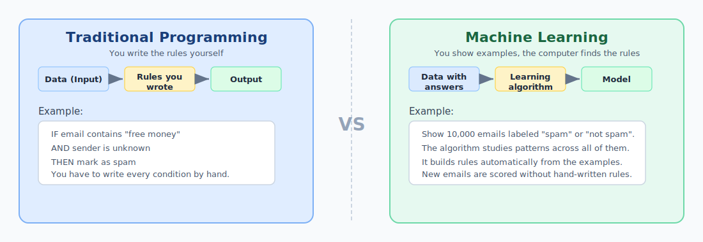
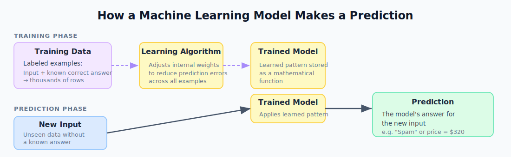
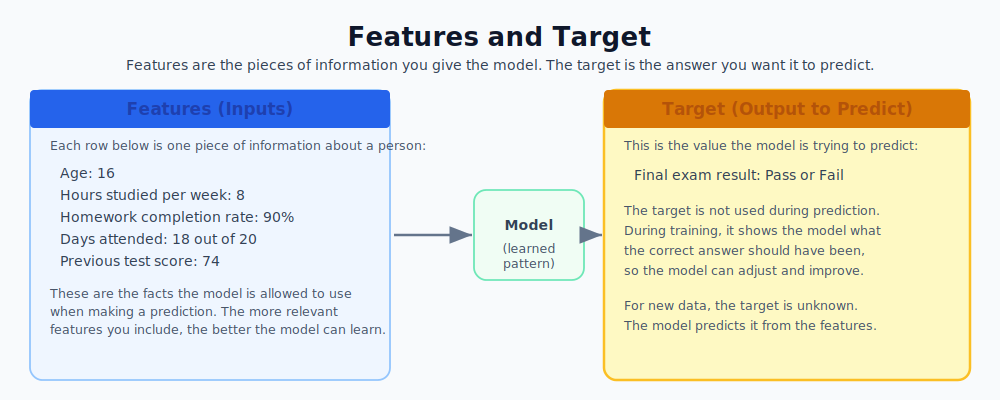
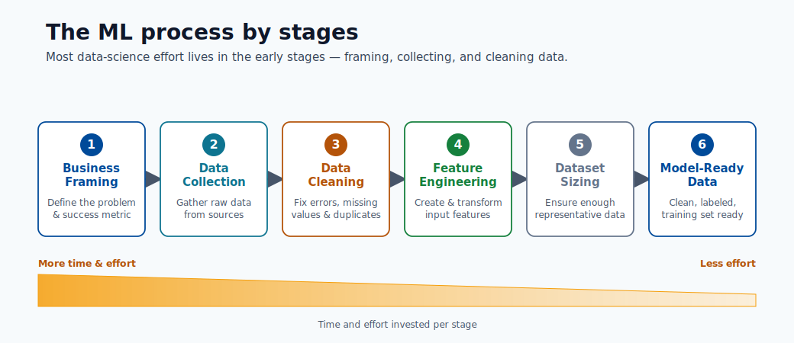

# 01. Machine Learning Basics

Machine learning is a way to teach computers by examples instead of writing every rule by hand.

If you remember one idea first: ML learns from past examples, then uses that learning to make a prediction for a new case.

## Quick Review Links

- Build your first model: [Module 05](05-build-your-first-model.md)
- Deploy a trained model: [Module 06](06-deploy-and-score.md)
- Final recap and next steps: [Module 09](09-wrap-up-and-next-steps.md)

## What ML Is and What It Is Not

Machine learning **is**:

- A method for finding patterns in data.
- A way to make predictions for new examples.
- A process that depends on training data, testing, and evaluation.

Machine learning is **not**:

- A replacement for clear problem definition.
- A guarantee of correct answers.
- A one-time task that ends after training.

## Traditional Programming vs Machine Learning

In traditional programming, a developer writes every rule the computer must follow. If the rule is not written, the computer does not know what to do.

In machine learning, the developer provides examples instead. The system finds the patterns itself and can then apply those patterns to new, unseen situations.

## How a Model Learns

A machine learning model is a pattern engine. It takes input values and returns an output prediction.

During **training**, the model sees many examples with correct answers. After each guess, it adjusts itself to reduce error. Over time, those adjustments become smaller, and the model gets better at predicting new examples.

You can think of this like practicing math problems: feedback helps you improve until mistakes are less frequent.

## Key Vocabulary

| Term | Meaning |
|------|----------|
| **Data** | The collection of examples used for learning or prediction. |
| **Feature** | A single measurable input variable (e.g., age, temperature, price). |
| **Target / Label** | The value the model is trying to predict. |
| **Training** | Showing the model labeled examples so it can learn. |
| **Testing** | Evaluating the trained model on examples it has never seen. |
| **Model** | The learned function that maps inputs to a predicted output. |
| **Prediction** | The model's output for a new, unlabeled input. |
| **Algorithm** | The procedure used to learn from data (e.g., decision trees, neural nets). |

## Features and Targets in Detail

Every ML problem has inputs and one output to predict. The inputs are called **features**. The output is called the **target**.

## The Three Types of Machine Learning

Machine learning is divided into three broad categories based on the type of data available during training.

**Supervised learning** uses labeled training data. For each input, the correct answer is provided. The model learns the mapping between inputs and answers.

**Unsupervised learning** uses data without labels. The model discovers structure, groups, or patterns on its own.

**Reinforcement learning** trains an agent that takes actions and receives rewards or penalties. Over many trials, the agent learns which actions lead to the best outcomes.

## Why Data Quality Matters

The quality of a machine learning model is directly tied to the quality of the data it trains on. Problems with data quality include:

- Missing values in features.
- Incorrect labels.
- Data that does not represent the real world (sampling bias).
- Features that are not relevant to the target.

Garbage in, garbage out. A well-designed algorithm cannot recover from fundamentally broken data.

## End-to-End ML Process

Every ML project follows the same basic sequence:

1. **Define the problem** — What do you want to predict? What counts as success?
2. **Collect and prepare data** — Gather examples with features and correct labels.
3. **Train a model** — Feed the data to a learning algorithm.
4. **Evaluate** — Test on unseen data and measure accuracy.
5. **Deploy** — Make the model available to receive real requests.
6. **Monitor** — Track performance over time and retrain when quality drops.

## A Concrete Example: Predicting House Prices

Goal: Given information about a house, predict its sale price.

- **Features**: square footage, number of bedrooms, neighborhood, age of building.
- **Target**: sale price (a number).
- **Algorithm**: Linear Regression.
- **Training**: model sees thousands of past sales with known prices.
- **Prediction**: model receives a new house's features and returns an estimated price.

## How This Connects to Software Engineering

Machine learning projects are also software projects.

- A **software engineer** writes code that loads data, trains models, and serves predictions.
- Teams use a **repository** (repo) to track changes in code and configuration.
- Teams use **logs** to debug problems when predictions look wrong.
- Teams deploy models as **APIs** so other systems can request predictions.

So ML is not separate from software engineering. It is software engineering plus data-driven prediction.

## Real-World Applications

- Email spam detection.
- Product and video recommendations.
- Fraud detection in financial transactions.
- Medical image classification.
- Weather forecasting.
- Voice recognition and language translation.

## Final Perspective for This Module

If you remember one thing, remember this: machine learning is a structured process of learning from examples, validating honestly, and applying the learned pattern to new data. The model is not the goal by itself; reliable decisions from real data are the goal.
