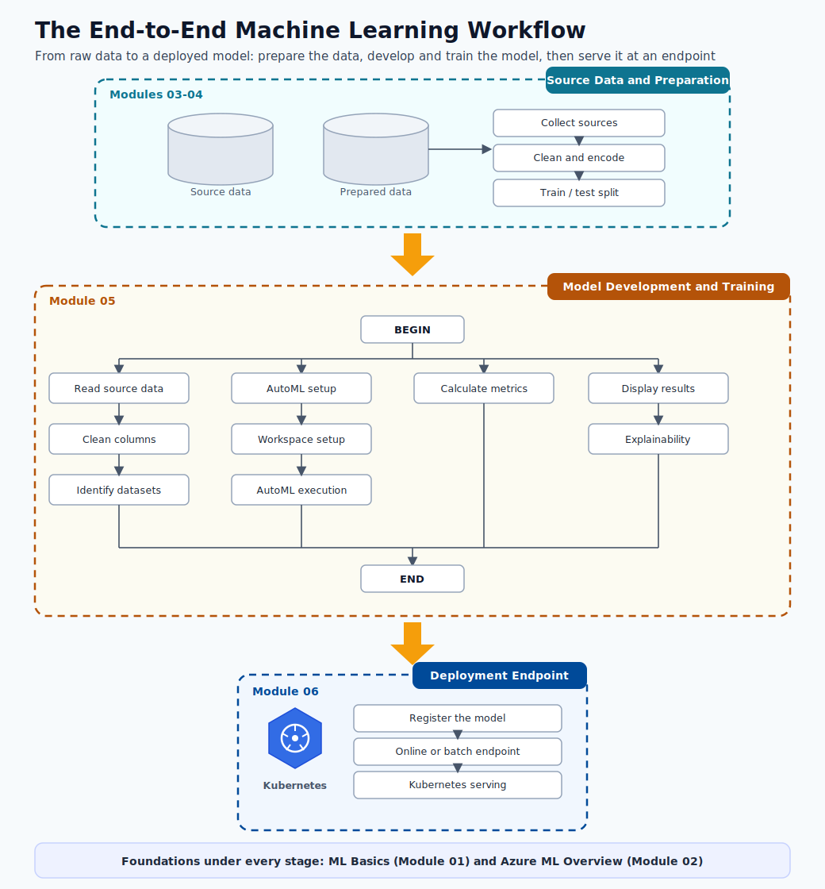
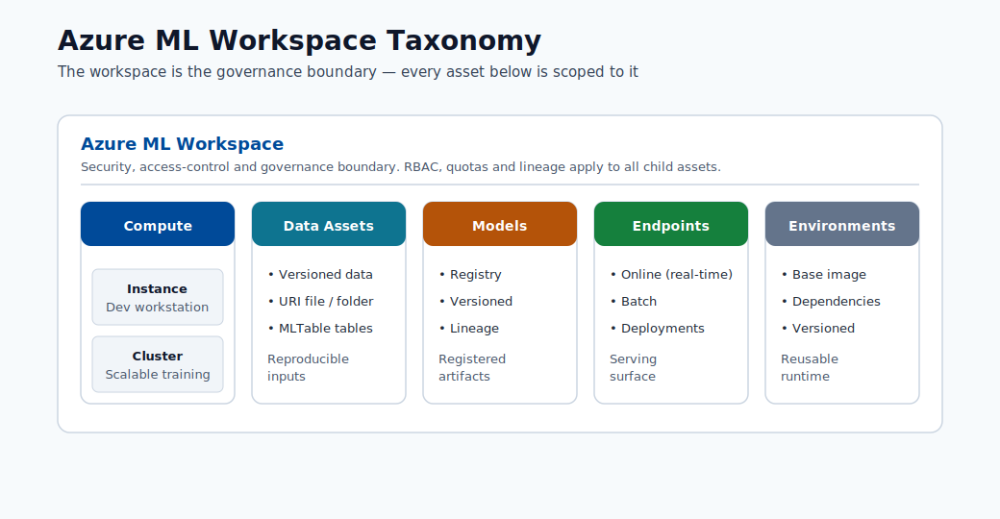
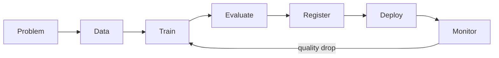
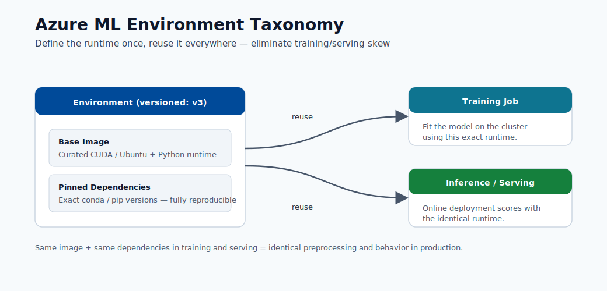

# 02. Azure ML Overview

Azure Machine Learning is Microsoft's managed cloud platform for the complete machine learning lifecycle. It brings together data, compute, code, and models in one workspace so teams can build, train, deploy, and monitor solutions reliably.

## Quick Review Links

- ML model basics: [Module 01](01-machine-learning-basics.md)
- Training and evaluation flow: [Module 05](05-build-your-first-model.md)
- Endpoint deployment: [Module 06](06-deploy-and-score.md)

## Bridge from Module 01

In [Module 01](01-machine-learning-basics.md), you learned how ML works at a concept level: features, targets, training, testing, and prediction.

Now the big question is: how do teams do that safely in real projects?

If you run experiments only on your laptop, problems appear quickly:

- Files get renamed many times (`final_model_v2_really_final.pkl`).
- Teammates cannot reproduce your results.
- No one is sure which model version is running.

Azure ML solves this by giving your project one shared place where everything is tracked.

## Why a Managed Platform Matters

Without a managed platform, every team member has to set up their own environment, track experiments manually, and version models by hand. This leads to:

- Results that cannot be reproduced.
- Models deployed with no record of how they were built.
- Experiments scattered across laptops and notebooks.

Azure ML solves this by providing a single controlled environment where every action is tracked.

### A Simple Real-World Example

Imagine a school project team builds a model to predict student quiz support needs.

- Student A trains a model on dataset version 1.
- Student B retrains using slightly different data and gets better results.
- Two weeks later, no one remembers which model was deployed.

With Azure ML, this confusion is avoided because dataset versions, runs, metrics, and model versions are automatically recorded.

## What Azure ML Gives You

- **One workspace** for all assets: data, code, environments, models, endpoints.
- **Managed compute** that scales with your workload.
- **Full experiment tracking** with metrics, parameters, and outputs logged automatically.
- **Model versioning** so you always know which model is running in production.
- **Deployment infrastructure** that handles scaling and authentication.
- **Monitoring** to detect when a deployed model's quality is degrading.

## The ML Lifecycle in Azure ML

Every project in Azure ML follows these stages:

1. **Problem definition** — What question should the model answer?
2. **Data preparation** — Register versioned datasets, clean data, engineer features.
3. **Training** — Run a job that feeds data to an algorithm and produces a model.
4. **Evaluation** — Review metrics to confirm the model meets quality requirements.
5. **Registration** — Save the trained model to the model registry with metadata.
6. **Deployment** — Publish the model as an endpoint that accepts prediction requests.
7. **Monitoring** — Track accuracy, latency, and data drift over time.

Where:

- **Latency** means response time (how long a prediction takes to return).
- **Data drift** means new real-world input data no longer looks like training data.

## Core Terms

| Term | Meaning |
|------|----------|
| **Workspace** | The top-level container for all project assets. |
| **Compute** | The machines (CPU/GPU) that execute jobs. |
| **Job** | One run of your code with inputs, outputs, and logged metrics. |
| **Environment** | A versioned definition of Python packages and runtime dependencies. |
| **Model registry** | A versioned store of all trained model files. |
| **Endpoint** | A deployed model exposed as an HTTP URL for predictions. |
| **Data asset** | A registered, versioned reference to a dataset. |

## Why Monitoring Exists

Data in the real world changes over time. A model trained on last year's data may become inaccurate when the world changes. Monitoring lets you:

- Detect performance drops before they affect users.
- Trigger retraining when accuracy falls below a threshold.
- Detect data drift, which means the distribution of inputs has shifted from what the model was trained on.

Example: if a model learned from last year's shopping behavior, but customer behavior changes this year, accuracy can drop. Monitoring helps you notice this early.

## Where Azure ML Fits in the Microsoft AI Ecosystem

| Platform | Best For |
|----------|----------|
| **Azure ML** | Full ML lifecycle: training, deployment, and ongoing model operations. |
| **Microsoft Fabric** | Unified data analytics and collaborative data engineering. |
| **Azure AI Foundry** | Building AI-powered applications with LLMs and APIs. |

