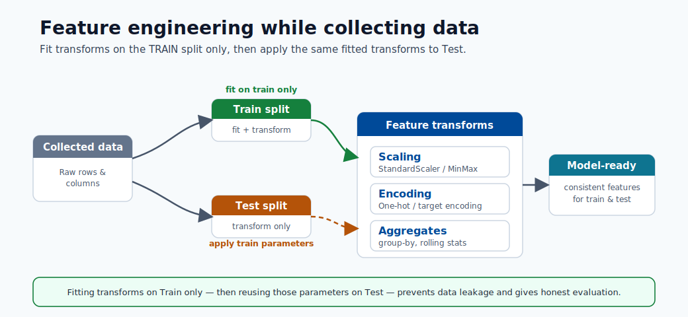
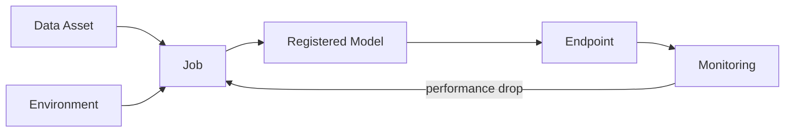
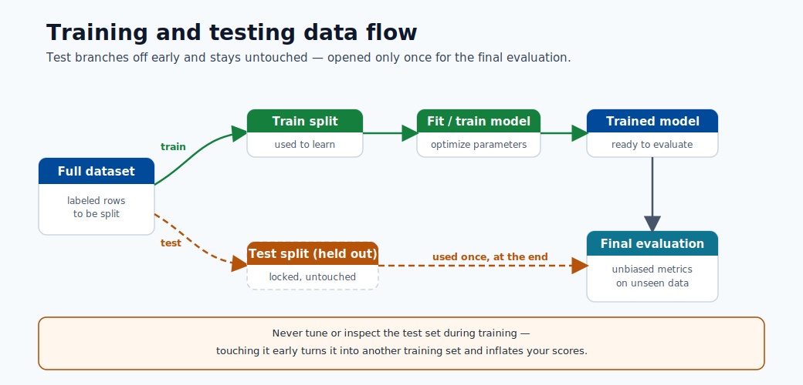
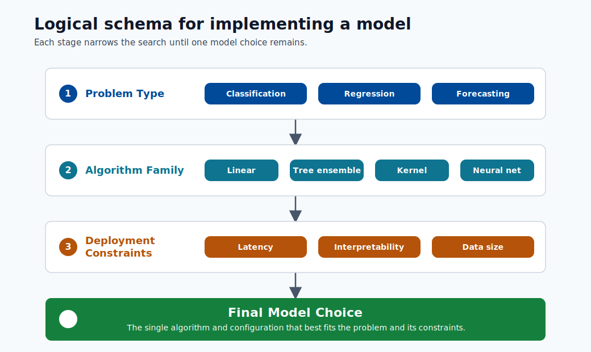

# 04. Assets and Lifecycle

In Azure ML, an **asset** is any important piece of your project that is saved, versioned, and reusable. Managing assets carefully is the difference between a project that anyone can reproduce and one that only works on the original developer's machine.

In beginner terms: assets are the building blocks of your ML project, and versioning means you can go back and check exactly what changed.

## Quick Review Links

- ML model fundamentals: [Module 01](01-machine-learning-basics.md)
- Workspace and authoring context: [Module 03](03-workspace-and-authoring.md)
- Build and register models: [Module 05](05-build-your-first-model.md)
- Deploy model endpoints: [Module 06](06-deploy-and-score.md)

## Why Asset Management Matters

Without careful asset tracking you cannot answer these critical questions:

- Which dataset was used to train the model currently in production?
- Which version of my data-cleaning code was used in the last run?
- Why did the model perform better last week than today?

Assets give every experiment a complete audit trail.

You can think of this like version history in school assignments: who changed what, and when.

## The Five Core Assets

### 1. Data Assets

A data asset is a named, versioned reference to a dataset. The data can be stored in Azure Blob Storage, Azure Data Lake, or a local upload. By registering data as an asset, every job that uses it records which version it consumed.

### 2. Environments

An environment defines the exact Python packages, versions, and base Docker image that your code needs. Every job specifies an environment. If you train today and retrain in six months, the same environment guarantees the same runtime, eliminating "it worked on my machine" problems.

### 3. Jobs

A job is one execution of code. A training job takes data and an environment as inputs and produces a model as output. Every job records:

- The code that ran.
- The parameters used.
- The metrics logged during execution.
- The output files produced.

These are the output files produced by the run.

### 4. Models

A model is a trained model file stored in the model registry. Each registration captures the metrics the model achieved, the job that produced it, and the data and environment used in training. You can compare model versions side by side and promote a specific version to deployment.

### 5. Endpoints

An endpoint is a deployed model exposed as a live API. It accepts HTTP requests with input data and returns predictions. An endpoint is always linked back to a specific model version in the registry.

## The Asset Lifecycle

## Project History (Lineage)

Project history (often called lineage) is the complete record connecting an endpoint back through every asset used to create it. If a model gives wrong predictions, you can trace exactly which data, code version, and environment produced it, and identify where the problem began.

Why this matters: debugging is much faster when you can trace mistakes to one exact step.

## An Analogy

Think of building a product:

- Data = raw materials.
- Environment = factory configuration.
- Job = the production run.
- Model = the finished product.
- Endpoint = the store shelf where customers pick it up.
- Project history = the production record that tells you exactly how each product was made.

