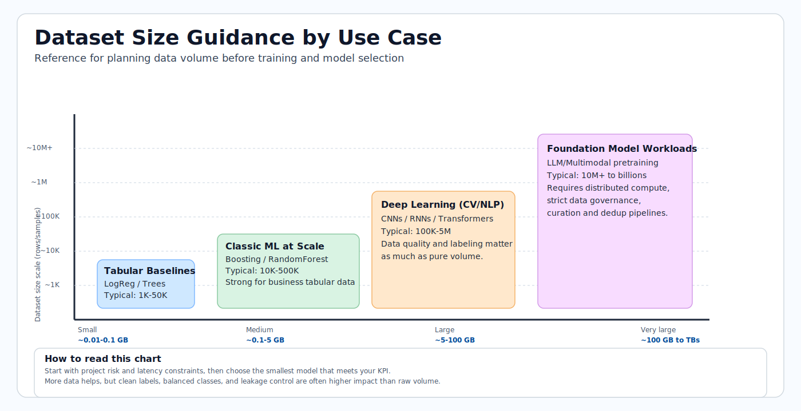
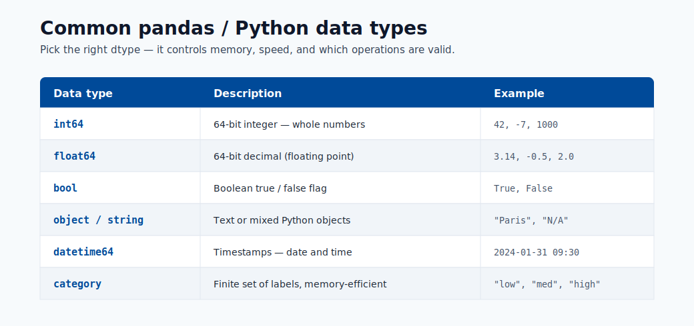

# 08. Fabric and AI Integration

Microsoft Fabric is a unified analytics platform that brings together data engineering, data warehousing, data science, real-time analytics, and business intelligence in a single environment. It complements Azure ML by handling the data side of the workflow.

Beginner view: Fabric is very strong for data preparation and reporting, while Azure ML is strong for model training and deployment.

## Quick Review Links

- ML model fundamentals: [Module 01](01-machine-learning-basics.md)
- Build and evaluate models: [Module 05](05-build-your-first-model.md)
- Deploy model endpoints: [Module 06](06-deploy-and-score.md)


## What Microsoft Fabric Is

Fabric organizes data work into experiences:

- **OneLake**: one shared place to store data.
- **Data Factory**: pipelines that move and transform data.
- **Data Engineering**: tools for large-scale data preparation.
- **Data Science**: notebooks for experiments.
- **Power BI**: dashboards and reports.

## How Fabric and Azure ML Work Together

| Stage | Fabric | Azure ML |
|-------|--------|----------|
| Raw data ingestion | ✓ | |
| Data transformation | ✓ | |
| Feature engineering at scale | ✓ (Spark) | |
| Model training and tracking | | ✓ |
| Model deployment and endpoints | | ✓ |
| Batch scoring on large datasets | ✓ (can trigger Azure ML batch) | ✓ |
| BI and reporting on predictions | ✓ (Power BI) | |



## LangChain and SynapseML for AI Workflows

**SynapseML** is a library for large-scale ML processing in Spark environments.

**LangChain** helps connect prompts, tools, and LLM calls into multi-step workflows.

These tools are optional for beginners. First master data preparation, model training, and deployment.

When you are ready, they can support use cases like:

- Document summarization across a large document store.
- Question-answering over a PDF library.
- Automated report generation from structured data.

## How to Connect Azure OpenAI in Fabric

```python
import os
from langchain_openai import AzureChatOpenAI

os.environ["OPENAI_API_VERSION"] = "2024-02-01"
os.environ["AZURE_OPENAI_ENDPOINT"] = "https://your-resource.openai.azure.com"
os.environ["AZURE_OPENAI_API_KEY"] = "your-key"

llm = AzureChatOpenAI(deployment_name="gpt-4o", temperature=0.2)
response = llm.invoke("Summarize the key risks in this report: ...")
```

You do not need to memorize this code now. The main idea is that Fabric notebooks can call Azure OpenAI services.



## Decision Guide: When to Use Which Platform

**Use Fabric when:**

- Your primary bottleneck is data preparation, transformation, or analytics.
- You need Spark-scale processing on very large datasets.
- You need business intelligence reports alongside your data work.

**Use Azure ML when:**

- Your primary bottleneck is model training, experimentation, or deployment.
- You need full model operations features: versioning, project history tracking, staged deployment, and monitoring.
- You need online endpoints with response-time targets.

**Use both when:**

- Data preparation happens at Fabric scale, and trained models are deployed as Azure ML endpoints.
- The Fabric Data Science experience is used for initial exploration, and Azure ML is used for production-grade training and deployment.
