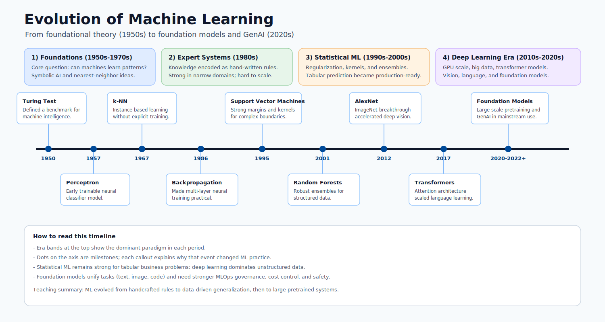

# 09. Wrap-Up and Next Steps

This module consolidates everything covered in Machine Learning Fundamentals and provides a structured plan for continuing the work.

## Quick Review Links

- Model fundamentals: [Module 01](01-machine-learning-basics.md)
- Build and evaluate models: [Module 05](05-build-your-first-model.md)
- Deploy and score endpoints: [Module 06](06-deploy-and-score.md)

## What You Now Understand

### Machine Learning Foundations

- Machine learning finds patterns in data rather than following hand-written rules.
- Supervised learning uses labeled data. Unsupervised learning discovers structure without labels. Reinforcement learning learns through rewards.
- Every ML project requires features (inputs) and a target (output to predict).
- Data quality directly determines model quality.

### Azure ML Platform

- The workspace is the central container for all project assets.
- Assets include data, environments, jobs, models, and endpoints.
- Every asset is versioned and linked to produce a complete project history.
- Training and deployment are separate phases with different compute and objectives.

### Model Building

- Data must be cleaned, encoded, and split before training.
- Common starting algorithms include Linear Regression, Decision Trees, and Random Forests.
- Metrics like MAE, RMSE, R², Accuracy, Precision, and Recall measure model quality.
- Overfitting means the model memorized training data. Underfitting means it did not learn enough.

### Deployment and Operations

- A trained model is deployed as an endpoint that accepts HTTP requests.
- Online endpoints return predictions in real time. Batch endpoints process large datasets.
- Monitoring detects quality drops and data drift after deployment.
- Infrastructure is managed with Terraform for repeatability.

## Knowledge Check

Try explaining each of the following without looking at your notes:

1. What is the difference between a feature and a target? Give a concrete example.
2. Why do we split data into training and test sets?
3. What does overfitting look like in terms of training vs test scores?
4. What happens inside an endpoint when it receives a request?
5. Why is an environment important for reproducibility?
6. What does `terraform destroy` do and when should you run it?

## Next Steps

### Deeper Exploration

- Try AutoML on the same dataset and compare with your manual model.
- Add a second feature set and measure whether metrics improve.
- Deploy a model and test it with five different input payloads.
- Set up monitoring on a deployed endpoint and inspect the logs.

### Recommended Resources

- [Azure ML Documentation](https://learn.microsoft.com/azure/machine-learning/)
- [Terraform Azure Provider](https://registry.terraform.io/providers/hashicorp/azurerm/latest)
- [Microsoft Fabric Documentation](https://learn.microsoft.com/fabric/)

## Final Close

Machine learning is pattern learning from data, and Azure ML organizes that learning into a repeatable and deployable workflow. The concepts in Machine Learning Fundamentals apply to every domain — healthcare, finance, retail, or education — because the underlying process is the same: define the question, prepare the data, train the model, evaluate it honestly, deploy it responsibly, and monitor it continuously.

## One Clear Perspective to Keep

When you finish Machine Learning Fundamentals, keep this perspective:

1. ML is a decision-support tool built from data patterns.
2. The strongest model is not the one with the most complexity, but the one that generalizes well to new data.
3. Data quality, evaluation quality, and monitoring quality are as important as algorithm choice.
4. Real ML success is measured by useful, trustworthy outcomes in production.

