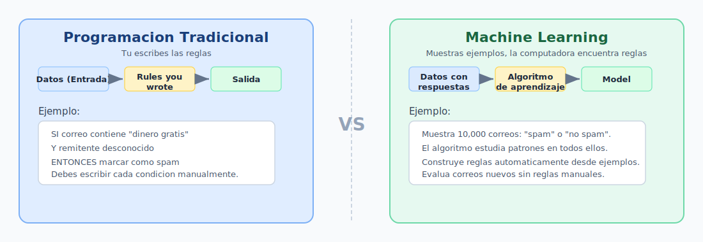
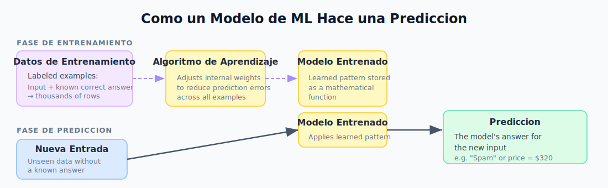
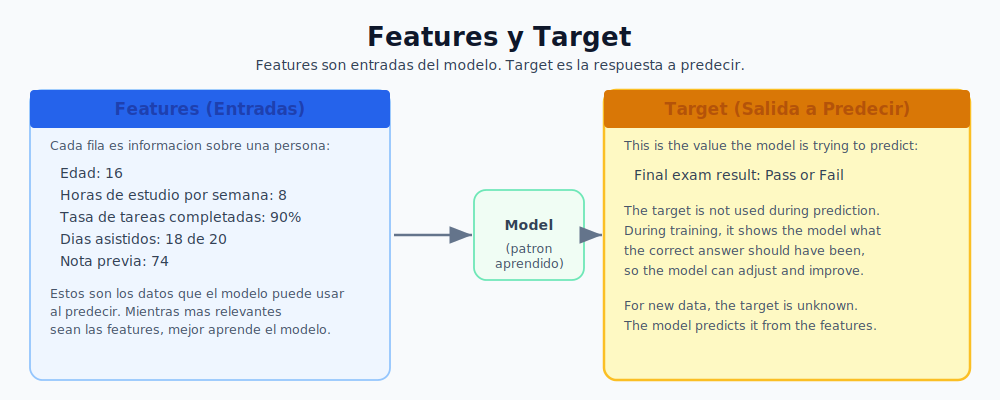
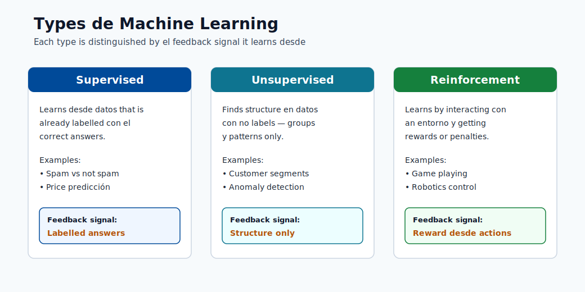
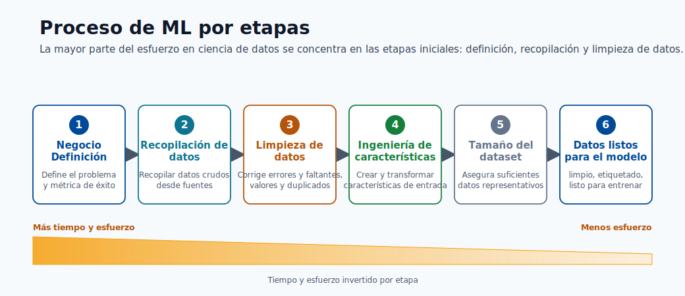
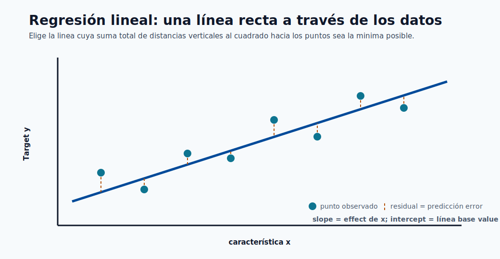

# 01. Fundamentos de aprendizaje automático

Machine learning es una forma de ensenar computadoras con ejemplos, en lugar de escribir todas las reglas manualmente.

## Enlaces Rápidos

- Construir el primer modelo: [Módulo 05](05-build-your-first-model.md)
- Desplegar modelo: [Módulo 06](06-deploy-and-score.md)
- Cierre del curso: [Módulo 09](09-wrap-up-and-next-steps.md)

## Qué Es y Que No Es ML

Machine learning **si es**:

- Metodo para encontrar patrones en datos.
- Forma de predecir casos nuevos.
- Proceso con entrenamiento, prueba y evaluación.

Machine learning **no es**:

- Reemplazo de definir bien el problema.
- Garantia de respuesta perfecta.
- Tarea de una sola vez.

## Programacion Tradicional vs ML

En programacion tradicional, se codifican reglas explicitas.
En ML, se entregan ejemplos y el sistema aprende patrones.

## Cómo Aprende un Modelo

Un modelo toma entradas y genera una predicción.
Durante entrenamiento, compara su predicción con la respuesta correcta y ajusta sus parámetros para reducir error.

## Vocabulario Clave

| Término | Significado |
|------|----------|
| **Data** | Conjunto de ejemplos para entrenar o predecir. |
| **Feature** | Variable de entrada (edad, precio, temperatura). |
| **Target / Label** | Valor que el modelo debe predecir. |
| **Training** | Etapa donde el modelo aprende con ejemplos. |
| **Testing** | Evaluación con datos no vistos. |
| **Model** | Funcion aprendida que transforma entradas en salida. |
| **Prediction** | Salida del modelo para un caso nuevo. |
| **Algorithm** | Metodo de aprendizaje (arboles, regresion, redes). |

## Features y Target

Todo problema de ML tiene entradas (features) y salida (target).

## Tipos de Machine Learning

- **Supervisado**: datos con etiqueta.
- **No supervisado**: descubre estructura sin etiqueta.
- **Refuerzo**: aprende por recompensa/castigo.

## Calidad de Datos

La calidad del modelo depende de la calidad del dato.
Problemas comunes:

- Valores faltantes.
- Etiquetas incorrectas.
- Sesgo de muestreo.
- Variables irrelevantes.

## Proceso de Punta a Punta

1. Definir problema.
2. Recolectar y preparar datos.
3. Entrenar modelo.
4. Evaluar con datos no vistos.
5. Desplegar.
6. Monitorear y reentrenar.

## Ejemplo: Precio de Casas

- **Features**: m2, dormitorios, barrio, antiguedad.
- **Target**: precio.
- **Algoritmo**: regresion lineal.

## Relacion con Software Engineering

Los proyectos de ML también son proyectos de software:

- Se usa código, repositorio, control de versiones y logs.
- Se exponen modelos por APIs.
- Se mantiene calidad en produccion.

## Perspectiva Final

ML es aprender de ejemplos, validar con honestidad y aplicar el patron a datos nuevos para apoyar decisiones reales.
