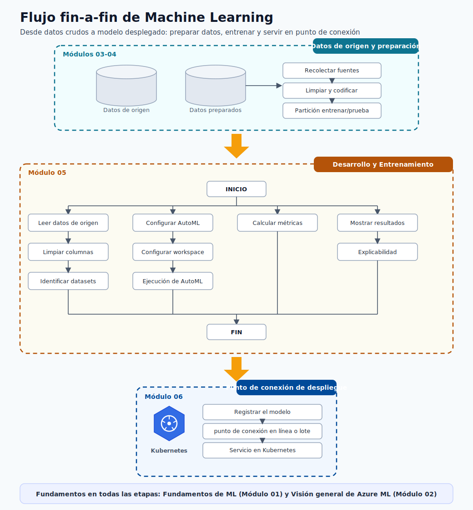
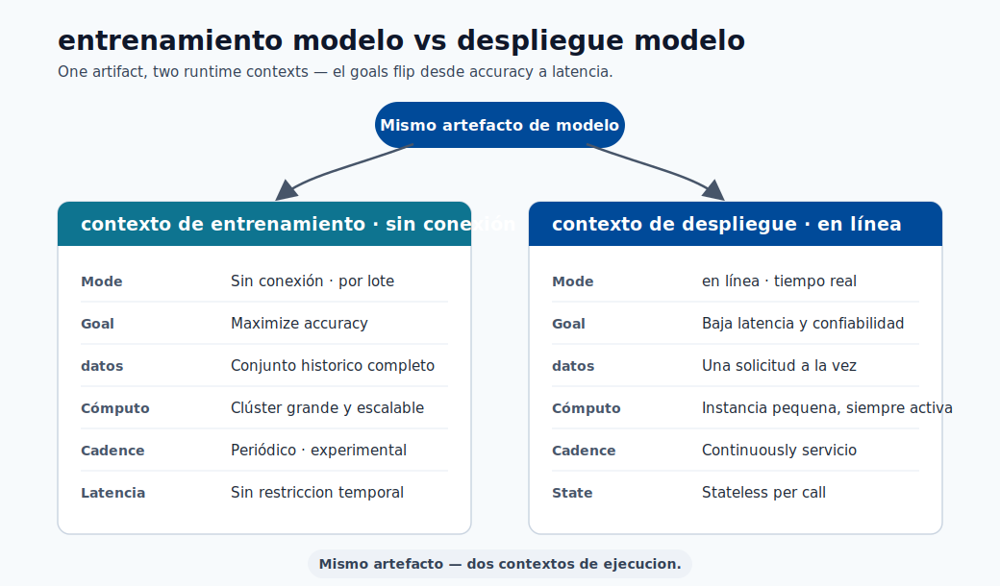
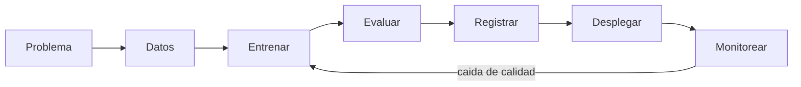
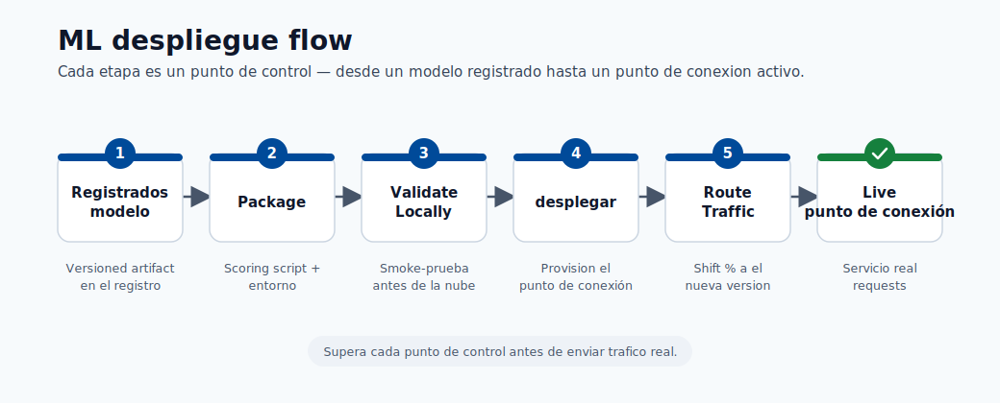

# 02. Visión General de Azure ML

Azure Machine Learning es una plataforma administrada para todo el ciclo de vida de ML: datos, entrenamiento, despliegue y monitoreo.

## Enlaces Rápidos

- Fundamentos de modelos: [Módulo 01](01-machine-learning-basics.md)
- Entrenamiento y evaluación: [Módulo 05](05-build-your-first-model.md)
- Despliegue de endpoint: [Módulo 06](06-deploy-and-score.md)

## Puente desde Módulo 01

En [Módulo 01](01-machine-learning-basics.md), viste características, variable objetivo, entrenamiento y prueba.
Ahora: cómo hacerlo en equipo y con trazabilidad real.

## Por Qué Usar Plataforma Administrada

Sin plataforma central:

- Resultados no reproducibles.
- Confusion de versiones de modelo.
- Experimentos dispersos en notebooks/laptops.

Con Azure ML:

- Un workspace unico.
- Historial automático de ejecuciónes.
- Versionado de datos, modelos y entornos.

## Qué Entrega Azure ML

- Workspace para datos, código, modelos y endpoints.
- Compute administrado.
- Tracking de experimentos.
- Versionado de modelos.
- Despliegue y monitoreo.

## Ciclo de Vida en Azure ML

1. Definir problema.
2. Preparar datos.
3. Entrenar.
4. Evaluar.
5. Registrar modelo.
6. Desplegar endpoint.
7. Monitorear.

- **Latency**: tiempo de respuesta de la predicción.
- **Data drift**: los datos actuales cambian respecto a entrenamiento.

## Términos Básicos

| Término | Significado |
|------|----------|
| **Workspace** | Contenedor principal del proyecto. |
| **Compute** | Máquinas que ejecutan jobs. |
| **Job** | Ejecución registrada de código. |
| **Environment** | Dependencias/versiones de runtime. |
| **Registro de modelos** | Almacén versionado de modelos. |
| **Endpoint** | URL para solicitar predicciones. |
| **Activo de datos** | Referencia versionada de dataset. |

## Por Qué Monitorear

El mundo cambia y la calidad del modelo puede bajar.
Monitorear permite detectar problemas y decidir reentrenamiento.

## Ecosistema Microsoft

| Plataforma | Uso Principal |
|----------|----------|
| **Azure ML** | Entrenar, desplegar y operar modelos. |
| **Microsoft Fabric** | Ingeniería y analítica de datos. |
| **Azure AI Foundry** | Aplicaciones con LLM y APIs. |

