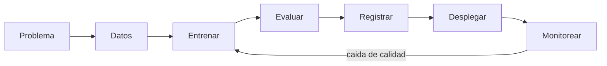

# 02. Vision General de Azure ML

Azure Machine Learning es una plataforma administrada para todo el ciclo de vida de ML: datos, entrenamiento, despliegue y monitoreo.

## Enlaces Rapidos

- Fundamentos de modelos: [Modulo 01](01-machine-learning-basics.md)
- Entrenamiento y evaluacion: [Modulo 05](05-build-your-first-model.md)
- Despliegue de endpoint: [Modulo 06](06-deploy-and-score.md)

## Puente desde Modulo 01

En [Modulo 01](01-machine-learning-basics.md), viste features, target, entrenamiento y testing.
Ahora: como hacerlo en equipo y con trazabilidad real.

## Por Que Usar Plataforma Administrada

Sin plataforma central:

- Resultados no reproducibles.
- Confusion de versiones de modelo.
- Experimentos dispersos en notebooks/laptops.

Con Azure ML:

- Un workspace unico.
- Historial automatico de ejecuciones.
- Versionado de datos, modelos y entornos.

## Que Entrega Azure ML

- Workspace para datos, codigo, modelos y endpoints.
- Compute administrado.
- Tracking de experimentos.
- Versionado de modelos.
- Despliegue y monitoreo.

## Ciclo de Vida en Azure ML

1. Definir problema.
2. Preparar datos.
3. Entrenar.
4. Evaluar.
5. Registrar modelo.
6. Desplegar endpoint.
7. Monitorear.

- **Latency**: tiempo de respuesta de la prediccion.
- **Data drift**: los datos actuales cambian respecto a entrenamiento.

## Terminos Basicos

| Termino | Significado |
|------|----------|
| **Workspace** | Contenedor principal del proyecto. |
| **Compute** | Maquinas que ejecutan jobs. |
| **Job** | Ejecucion registrada de codigo. |
| **Environment** | Dependencias/versiones de runtime. |
| **Model registry** | Almacen versionado de modelos. |
| **Endpoint** | URL para solicitar predicciones. |
| **Data asset** | Referencia versionada de dataset. |

## Por Que Monitorear

El mundo cambia y la calidad del modelo puede bajar.
Monitorear permite detectar problemas y decidir reentrenamiento.

## Ecosistema Microsoft

| Plataforma | Uso Principal |
|----------|----------|
| **Azure ML** | Entrenar, desplegar y operar modelos. |
| **Microsoft Fabric** | Ingenieria y analitica de datos. |
| **Azure AI Foundry** | Aplicaciones con LLM y APIs. |

