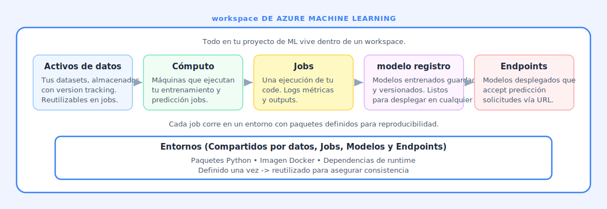
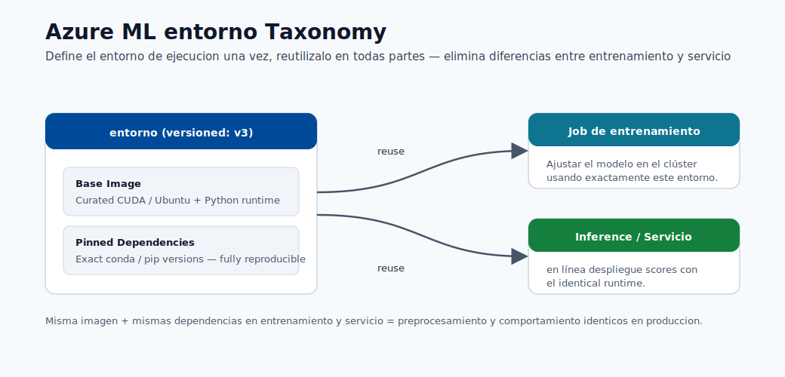
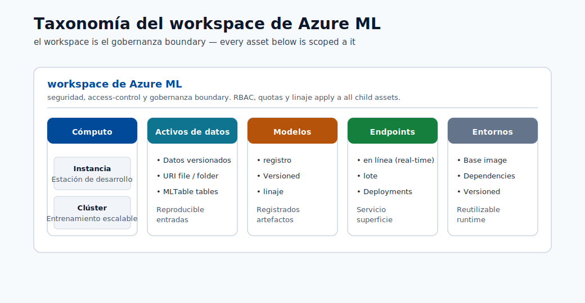
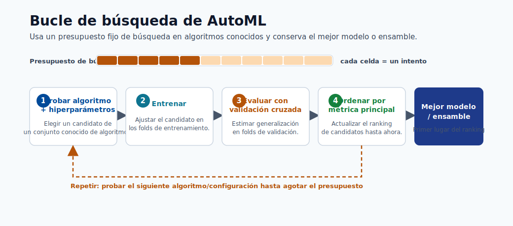
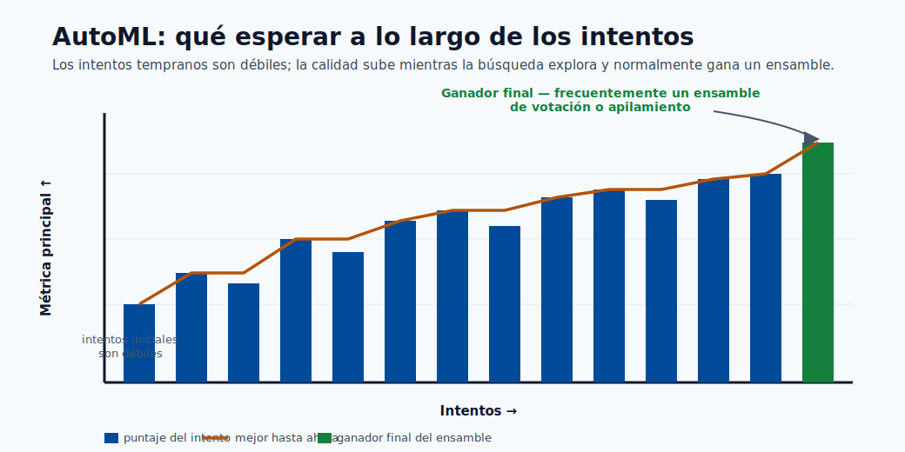

# 03. Workspace y Authoring

El workspace de Azure ML es el hogar del proyecto: datos, jobs, modelos y endpoints.

## Enlaces Rapidos

- Fundamentos de modelos: [Modulo 01](01-machine-learning-basics.md)
- Construccion de modelos: [Modulo 05](05-build-your-first-model.md)
- Despliegue de modelos: [Modulo 06](06-deploy-and-score.md)

## Componentes del Workspace

### Data Assets

Referencias versionadas de datasets para repetir experimentos de forma consistente.

### Compute

- **Compute instance**: VM para trabajo interactivo.
- **Compute cluster**: escalado automatico para jobs.
- **Serverless**: recursos bajo demanda.
- **Kubernetes**: opcion de despliegue robusto.

### Jobs

Cada ejecucion de entrenamiento queda registrada con parametros, metricas y salidas.

### Environments

Versiones fijas de paquetes para reproducibilidad.

### Model Registry

Almacen de modelos versionados con metadata de origen.

### Endpoints

API HTTP para predicciones online o batch.

## Opciones de Authoring

### Notebooks

Ejecucion por celdas para iterar rapido y aprender paso a paso.

### AutoML

Prueba algoritmos y configuraciones de forma automatica para obtener una buena base.

### Designer

Interfaz visual de pipelines por bloques.

## Vocabulario

| Termino | Significado |
|------|----------|
| **Experiment** | Grupo de ejecuciones relacionadas. |
| **Run** | Una ejecucion concreta. |
| **Pipeline** | Secuencia de pasos conectados. |
| **Output files** | Archivos de salida: modelo, metricas, logs. |
| **Project history** | Registro de que datos/codigo/entorno creo el modelo. |

## Conexion Completa

Workspace organiza, compute ejecuta, jobs entrenan, environment asegura consistencia, registry guarda modelos y endpoint los publica.
