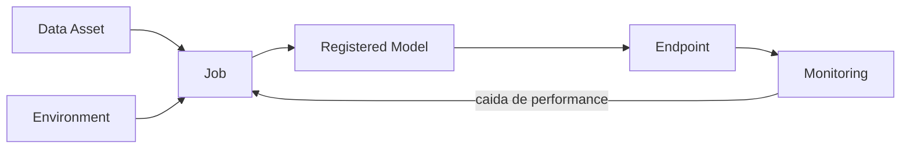

# 04. Assets y Ciclo de Vida

En Azure ML, un **asset** es una pieza versionada y reutilizable del proyecto.

## Enlaces Rapidos

- Fundamentos de modelos: [Modulo 01](01-machine-learning-basics.md)
- Workspace y authoring: [Modulo 03](03-workspace-and-authoring.md)
- Construir modelo: [Modulo 05](05-build-your-first-model.md)
- Desplegar endpoint: [Modulo 06](06-deploy-and-score.md)

## Por Que Importa

Sin gestion de assets no puedes responder:

- Que datos entrenaron el modelo en produccion.
- Que codigo exacto se ejecuto.
- Por que el rendimiento cambio.

## Cinco Assets Clave

### 1) Data assets

Referencia versionada al dataset usado en jobs.

### 2) Environments

Definen paquetes/versiones para ejecucion consistente.

### 3) Jobs

Una ejecucion de codigo que registra:

- Codigo.
- Parametros.
- Metricas.
- Archivos de salida.

### 4) Models

Modelo entrenado y versionado en el registry.

### 5) Endpoints

API activa asociada a una version concreta del modelo.

## Ciclo de Vida

## Historial del Proyecto (Lineage)

Es el rastro completo desde endpoint hasta datos y codigo de origen.
Sirve para debug y auditoria.

## Analogia Rapida

- Datos = materia prima.
- Environment = configuracion de fabrica.
- Job = corrida de produccion.
- Modelo = producto final.
- Endpoint = punto de uso.
- Historial = registro de produccion.

