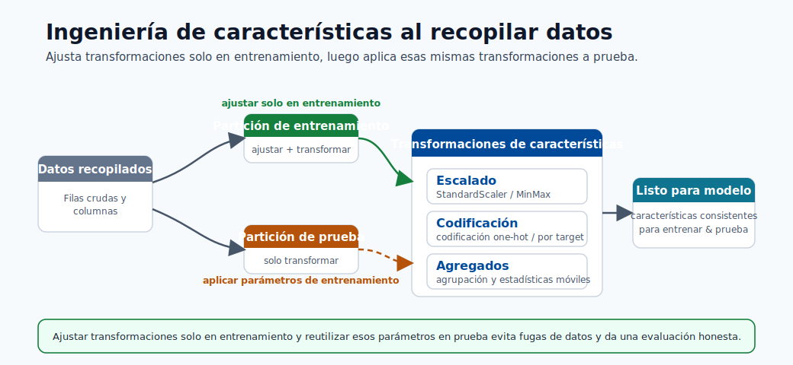
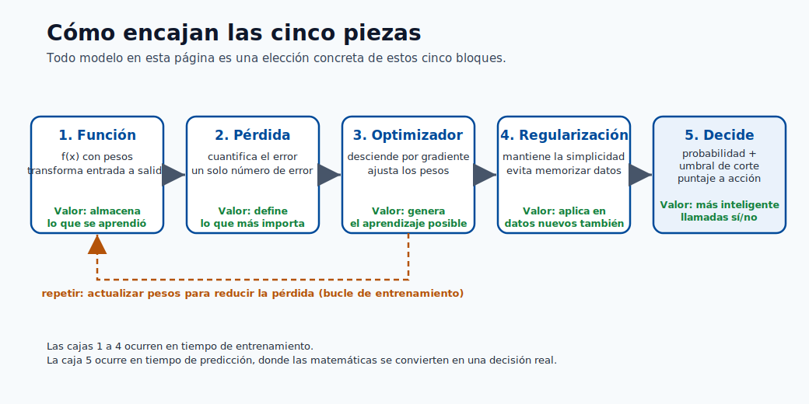
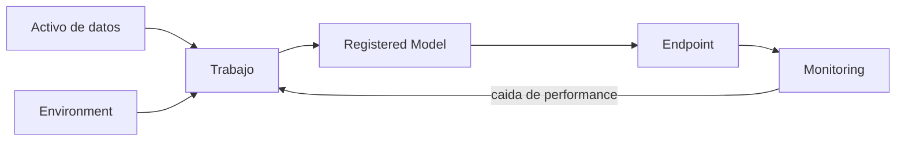
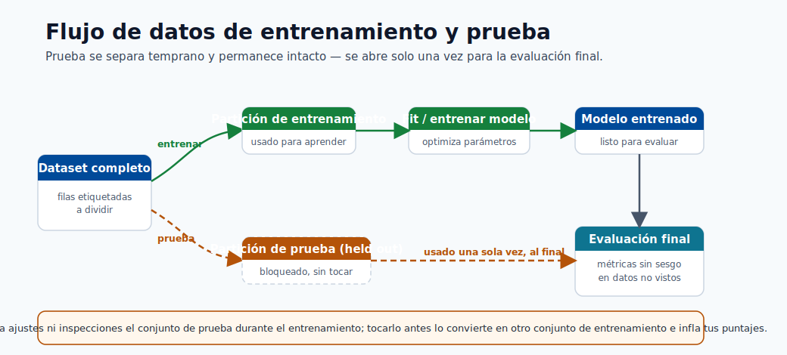
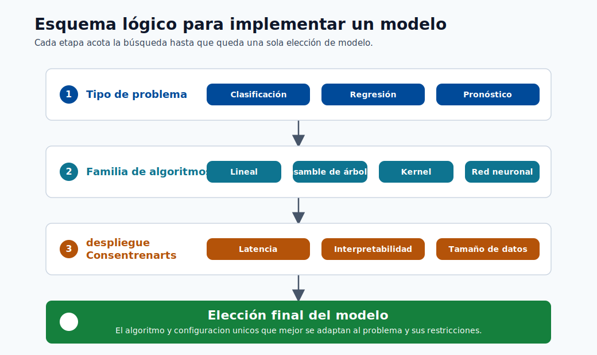
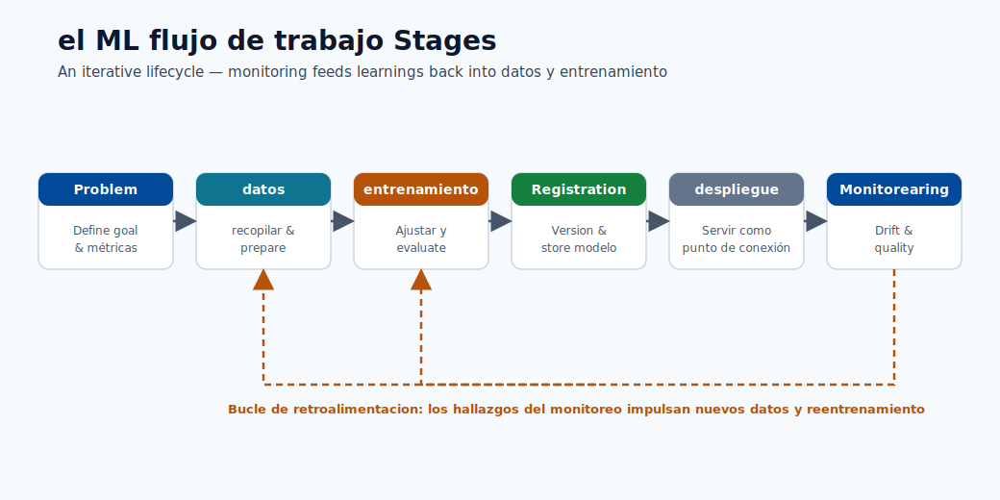

# 04. Assets y Ciclo de Vida

En Azure ML, un **asset** es una pieza versionada y reutilizable del proyecto.

## Enlaces Rápidos

- Fundamentos de modelos: [Módulo 01](01-machine-learning-basics.md)
- Workspace y authoría: [Módulo 03](03-workspace-and-authoring.md)
- Construir modelo: [Módulo 05](05-build-your-first-model.md)
- Desplegar endpoint: [Módulo 06](06-deploy-and-score.md)

## Por Qué Importa

Sin gestion de assets no puedes responder:

- Que datos entrenaron el modelo en produccion.
- Que código exacto se ejecuto.
- Por que el rendimiento cambio.

## Cinco Assets Clave

### 1) Activos de datos

Referencia versionada al dataset usado en jobs.

### 2) Entornos

Definen paquetes/versiones para ejecución consistente.

### 3) Trabajos

Una ejecución de código que registra:

- Código.
- Parámetros.
- Métricas.
- Archivos de salida.

### 4) Models

Modelo entrenado y versionado en el registry.

### 5) Puntos de conexión

API activa asociada a una versión concreta del modelo.

## Ciclo de Vida

## Historial del Proyecto (Linaje)

Es el rastro completo desde endpoint hasta datos y código de origen.
Sirve para debug y auditoria.

## Analogia Rapida

- Datos = materia prima.
- Environment = configuracion de fabrica.
- Job = corrida de produccion.
- Modelo = producto final.
- Endpoint = punto de uso.
- Historial = registro de produccion.

