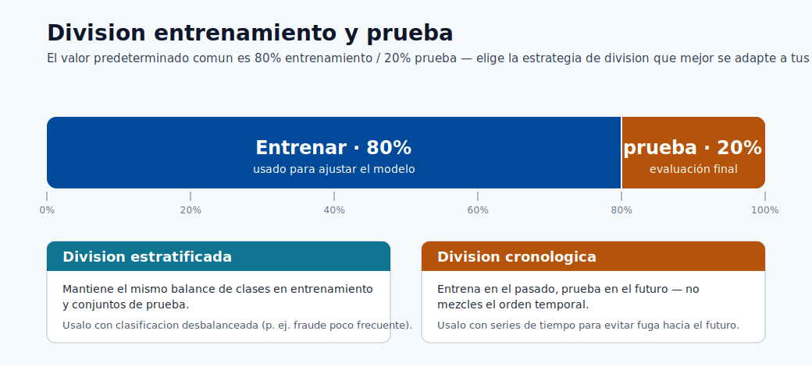
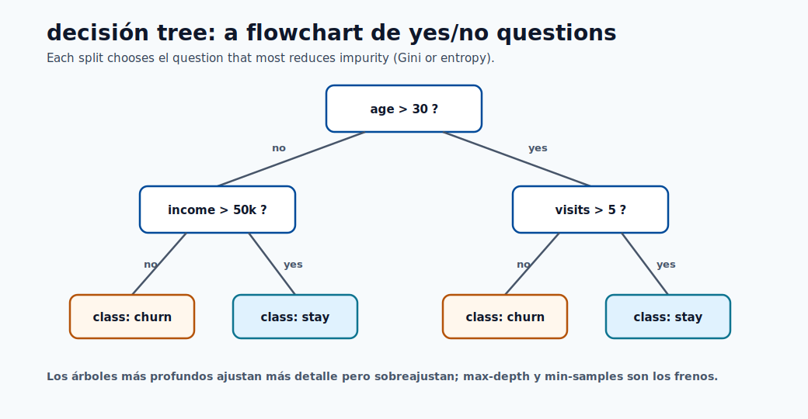
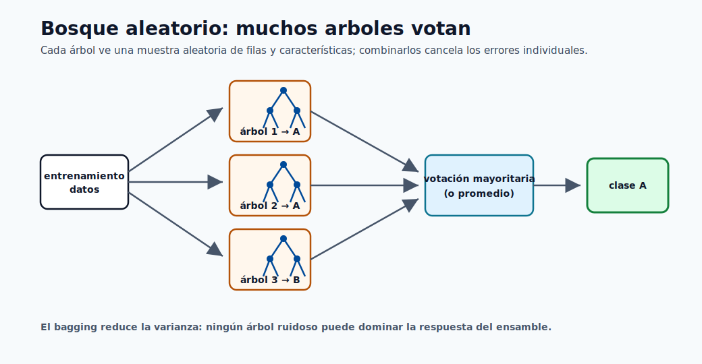
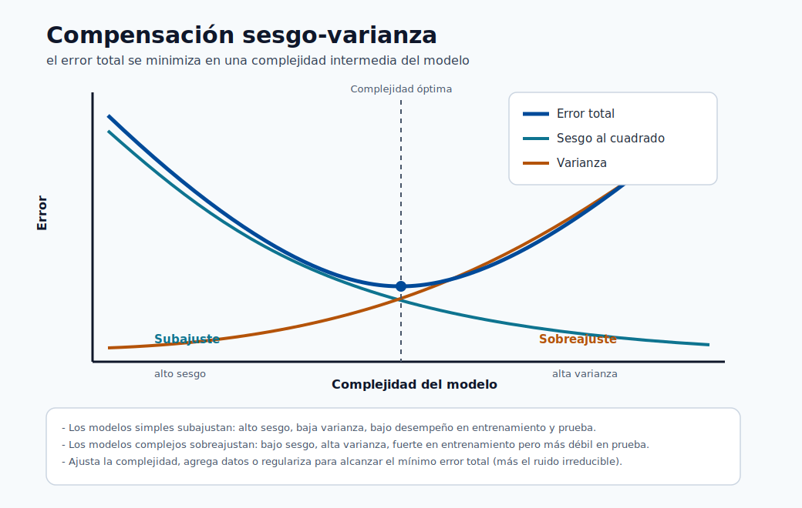
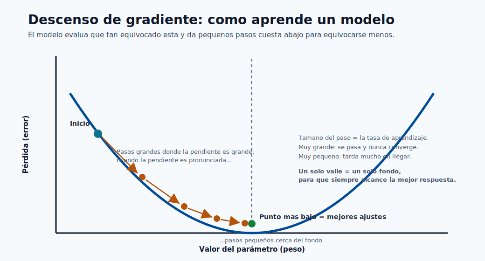
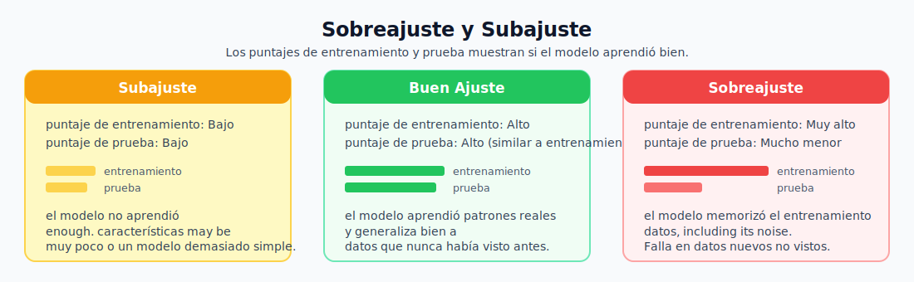

# 05. Construye Tu Primer Modelo

Este módulo cubre el flujo completo: desde datos crudos hasta un modelo evaluado y registrado.

## Enlaces Rápidos

- Fundamentos de modelos: [Módulo 01](01-machine-learning-basics.md)
- Flujo de plataforma: [Módulo 02](02-azure-ml-overview.md)
- Despliegue del modelo: [Módulo 06](06-deploy-and-score.md)

## Paso 1: Definir el Problema

Preguntas clave:

- Que quieres predecir.
- Que datos tienes.
- Que métrica define exito.

Ejemplo: predecir churn de cliente en 30 días.

## Paso 2: Entender los Datos

- Cantidad de filas/columnas.
- Valores faltantes.
- Distribución de la variable objetivo.
- Columnas sospechosas.


## Paso 3: Preparar Características

- Tratar valores faltantes (mean/median/mode o remover filas).
- Codificar categorias a numeros.
- Escalar variables numericas.
- Remover columnas irrelevantes.

## Paso 4: Dividir en Entrenamiento y Prueba

No evaluar con el mismo set de entrenamiento.
División típica: 80/20.



## Paso 5: Elegir y Entrenar Modelo

Modelos iniciales recomendados:

- Linear Regression.
- Logistic Regression.
- Decisión Tree.
- Random Forest.




## Paso 6: Evaluar

Una métrica es un numero que resume calidad del modelo.

### Regresión

- **MAE**: error medio absoluto.
- **RMSE**: error cuadratico medio (penaliza más errores grandes).
- **R2**: variacion explicada (0 a 1).

### Clasificación

- **Accuracy**: porcentaje total correcto.
- **Precision**: calidad de positivos predichos.
- **Recall**: cobertura de positivos reales.
- **F1**: balance entre precision y recall.




## Paso 7: Interpretar

- **Overfitting**: train alto, test bajo.
- **Underfitting**: ambos bajos.
- **Good fit**: ambos altos y cercanos.




## Paso 8: Registrar Modelo

```python
ml_client.models.create_or_update(
    Model(path="./model.pkl", name="churn-predictor", versión="1")
)
```

## Lista de verificación previa al despliegue

- [ ] Datos limpios y división correcta.
- [ ] Métricas cumplen objetivo.
- [ ] Resultado explicable.
- [ ] Modelo registrado con metadata.
- [ ] Flujo reproducible por otra persona.
