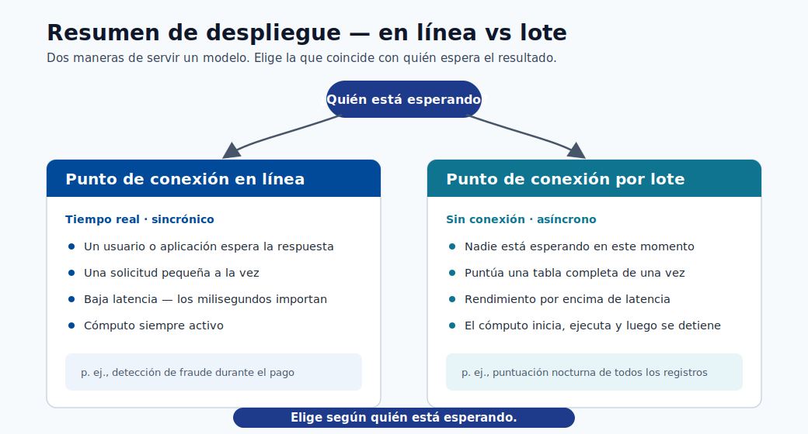
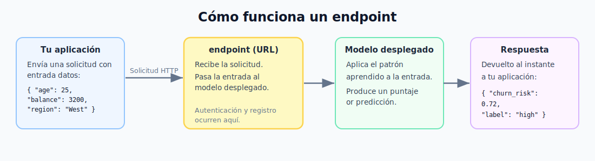
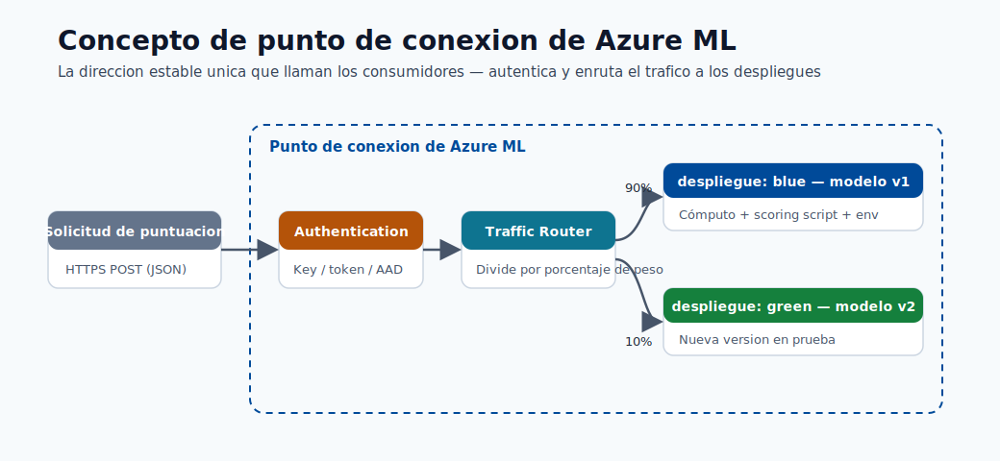
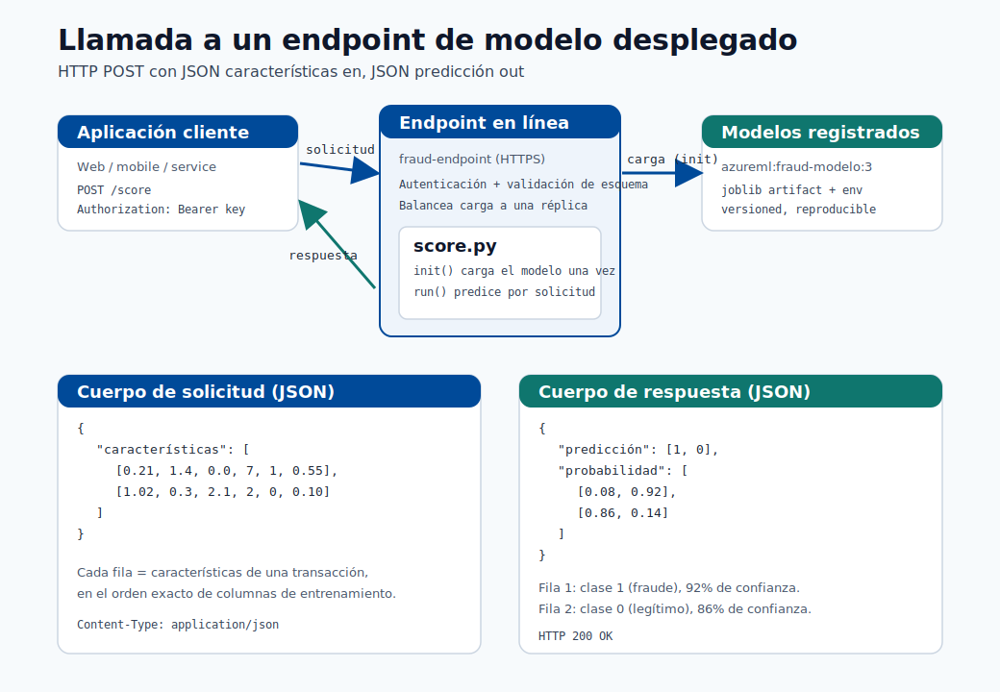
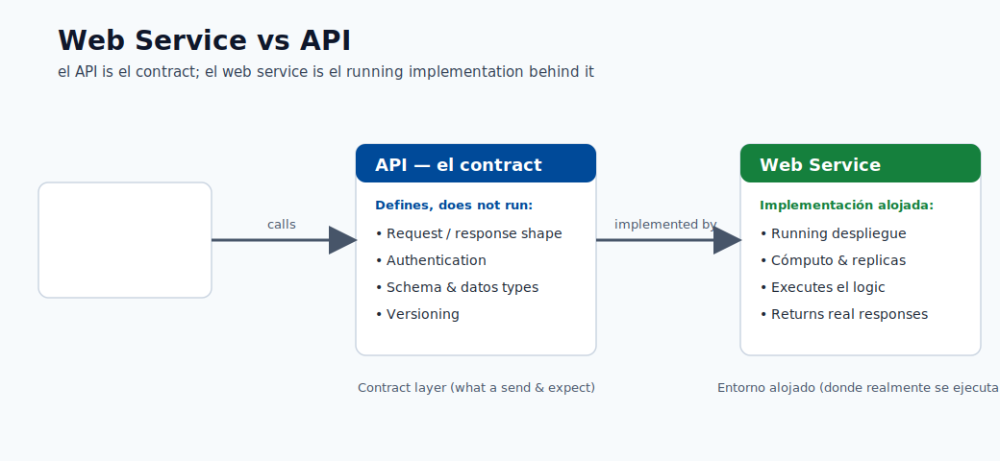
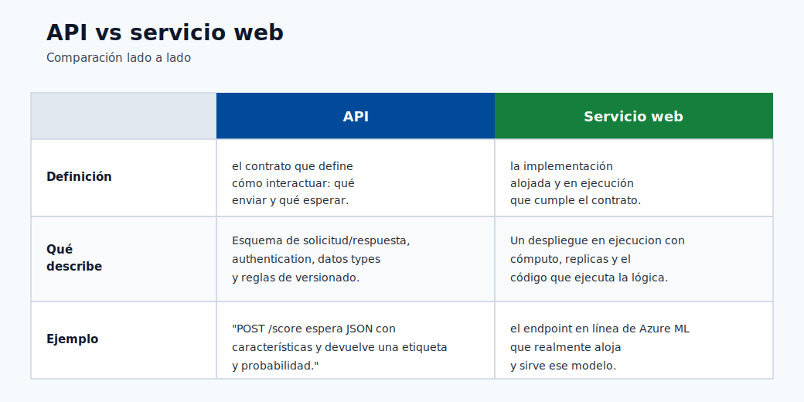
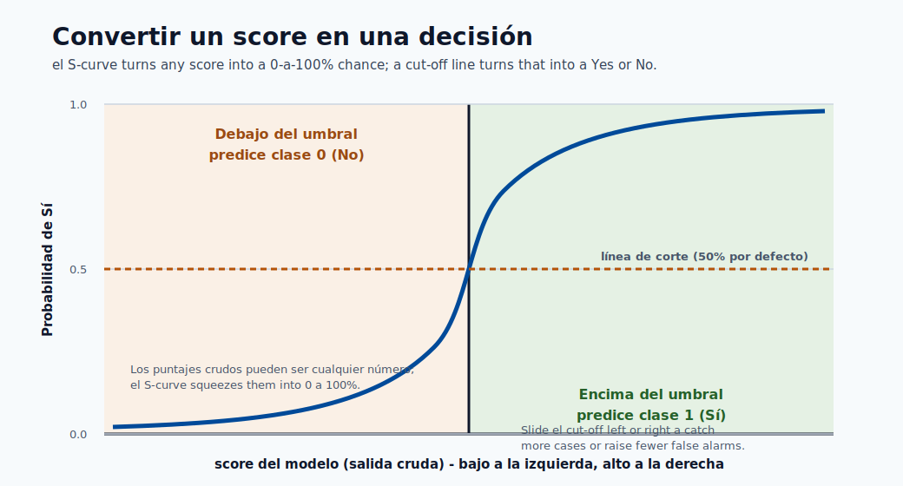

# 06. Despliegue y Scoring

Despliegue es cuando el modelo entrenado pasa a ser un servicio activo para recibir solicitudes y devolver predicciones.

## Enlaces Rápidos

- Fundamentos de modelos: [Módulo 01](01-machine-learning-basics.md)
- Construir y evaluar: [Módulo 05](05-build-your-first-model.md)
- Contexto de workspace: [Módulo 03](03-workspace-and-authoring.md)



## Training vs Deployment

- **Training**: fase offline para aprender con datasets grandes.
- **Deployment**: fase online para responder solicitudes reales.

## Qué es un Endpoint

Es una URL API HTTP a la que envías datos y recibes predicciones.

- **API**: forma estandar de comunicación entre programas.
- **HTTP**: protocolo web para request/response.



### Online Endpoint

Respuesta en tiempo real por solicitud.

### Batch Endpoint

Procesa grandes lotes de datos en segundo plano.



## Cinco Pasos de Deploy

1. Registrar modelo.
2. Crear `score.py` con:
   - `init()`: carga del modelo al iniciar.
   - `run(data)`: recibe datos y devuelve predicción.
3. Definir environment.
4. Desplegar endpoint.
5. Probar request/response.

En Python, una funcion es un bloque de código reutilizable.



## Formato de Datos

Ejemplo request JSON:

```json
{ "age": 34, "balance": 4200, "contract": "monthly" }
```

Ejemplo response JSON:

```json
{ "prediction": "churn", "probability": 0.81 }
```

JSON es formato de texto estandar para intercambio de datos.




## Checklist de Calidad

- Latencia dentro de limites.
- Formato de salida consistente.
- Manejo de entradas invalidas.
- Logs claros para debug.
- Autenticacion habilitada.

Si existe objetivo de tiempo de respuesta, validar contra ese limite.



## Control de Costos

- Apagar endpoints no usados.
- Elegir tamaño minimo viable de compute.
- Usar instancias pequenas en desarrollo.
