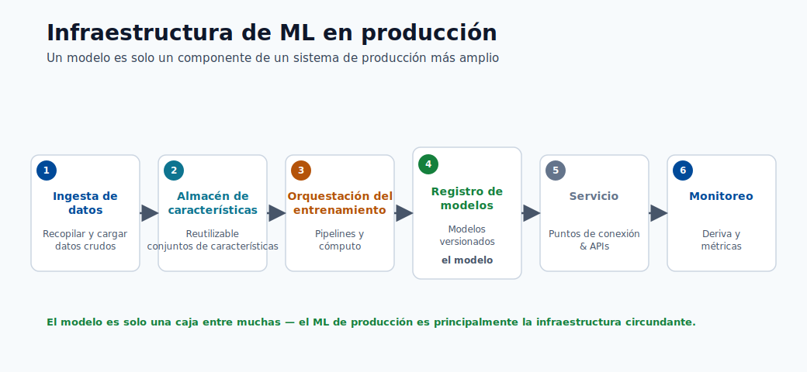
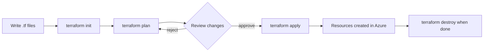

# 07. Fundamentos de Terraform

Terraform permite crear infraestructura cloud mediante archivos de codigo en lugar de clicks manuales.

## Enlaces Rapidos

- Fundamentos de modelos: [Modulo 01](01-machine-learning-basics.md)
- Ciclo de Azure ML: [Modulo 02](02-azure-ml-overview.md)
- Endpoints y deploy: [Modulo 06](06-deploy-and-score.md)

Este modulo presenta primero lo esencial para principiantes.



## Problema que Resuelve

Sin IaC:

- Ambientes distintos entre equipos.
- Sin historial claro de configuracion.
- Repeticion manual propensa a errores.

Con Terraform:

- Estado deseado en archivos `.tf`.
- Cambios previsibles con `plan`.
- Historial en control de versiones.

## Flujo Terraform




## Cuatro Comandos Clave

### `terraform init`

Inicializa providers necesarios.

### `terraform plan`

Muestra cambios antes de aplicar.

### `terraform apply`

Aplica cambios en Azure.

### `terraform destroy`

Elimina recursos administrados por Terraform.

## Vocabulario Basico

| Termino | Significado |
|------|----------|
| **Provider** | Plugin para conectarse al cloud (ej. Azure). |
| **Resource** | Pieza de infraestructura (storage, workspace). |
| **State** | Archivo con recursos administrados por Terraform. |
| **Variable** | Entrada reutilizable de configuracion. |
| **Output** | Valor mostrado al finalizar `apply`. |
| **Module** | Bloque reutilizable de Terraform. |
| **Backend** | Lugar donde se guarda el state (local o remoto). |

## Estructura de Archivos

```text
src/
├── main.tf
├── variables.tf
├── terraform.tfvars
├── provider.tf
├── outputs.tf
└── remote-storage.tf
```

## Conceptos Avanzados (Opcional)

- Remote state compartido.
- Locking de estado.
- Multi-ambiente (dev/test/prod).
- Modulos reutilizables.

## Seguridad de Costos

Al terminar practica:

1. Confirmar subscripcion/workspace correctos.
2. Ejecutar `terraform destroy -var-file terraform.tfvars`.
3. Verificar recursos eliminados.
