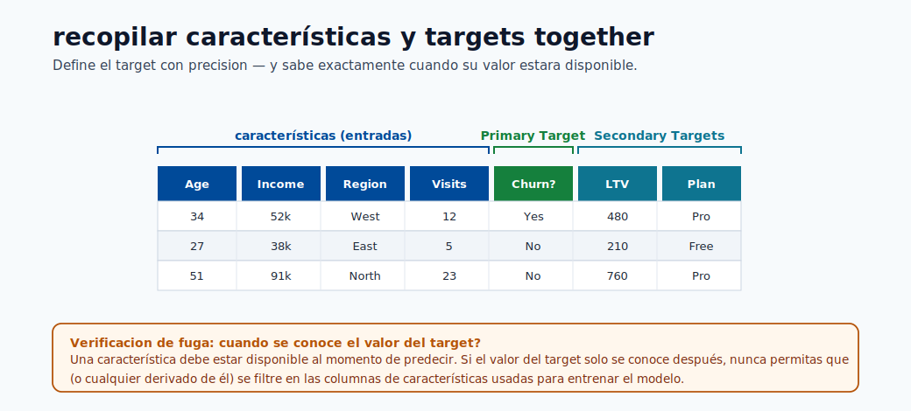
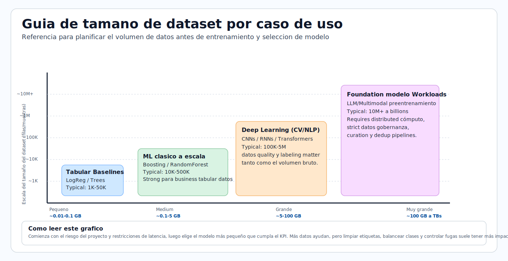
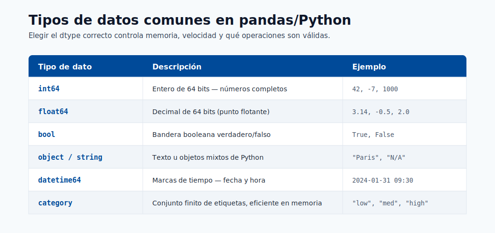

# 08. Fabric e Integracion con AI

Microsoft Fabric unifica analitica de datos y complementa Azure ML.

Vision para principiantes: Fabric prepara datos y reportes; Azure ML entrena y despliega modelos.

## Enlaces Rapidos

- Fundamentos de modelos: [Modulo 01](01-machine-learning-basics.md)
- Construccion de modelos: [Modulo 05](05-build-your-first-model.md)
- Despliegue de endpoints: [Modulo 06](06-deploy-and-score.md)



## Que es Microsoft Fabric

- **OneLake**: lugar unificado de datos.
- **Data Factory**: movimiento y transformacion de datos.
- **Data Engineering**: preparacion de datos a gran escala.
- **Data Science**: notebooks para experimentos.
- **Power BI**: dashboards y reportes.

## Fabric + Azure ML

| Etapa | Fabric | Azure ML |
|-------|--------|----------|
| Ingesta de datos | ✓ | |
| Transformacion de datos | ✓ | |
| Feature engineering a escala | ✓ (Spark) | |
| Entrenamiento y tracking | | ✓ |
| Deploy y endpoints | | ✓ |
| Batch scoring a gran escala | ✓ | ✓ |
| Reporting de predicciones | ✓ | |



## LangChain y SynapseML

- **SynapseML**: libreria para ML a gran escala en Spark.
- **LangChain**: orquesta flujos con prompts, herramientas y LLM.

Son opcionales para principiantes. Primero dominar: datos, entrenamiento, evaluacion y deploy.

## Conexion Azure OpenAI en Fabric

```python
import os
from langchain_openai import AzureChatOpenAI

os.environ["OPENAI_API_VERSION"] = "2024-02-01"
os.environ["AZURE_OPENAI_ENDPOINT"] = "https://your-resource.openai.azure.com"
os.environ["AZURE_OPENAI_API_KEY"] = "your-key"

llm = AzureChatOpenAI(deployment_name="gpt-4o", temperature=0.2)
response = llm.invoke("Resume riesgos clave del reporte: ...")
```

No es necesario memorizar este codigo ahora; el objetivo es entender la integracion.



## Guia de Decision

**Usa Fabric cuando:**

- Tu cuello de botella es preparacion/analitica de datos.
- Necesitas procesamiento distribuido y reportes.

**Usa Azure ML cuando:**

- Tu foco es entrenar, evaluar y desplegar modelos.
- Necesitas versionado, historial de proyecto y monitoreo.
- Necesitas endpoints online con objetivos de tiempo de respuesta.

**Usa ambos cuando:**

- Preparas datos en Fabric y despliegas modelos en Azure ML.
