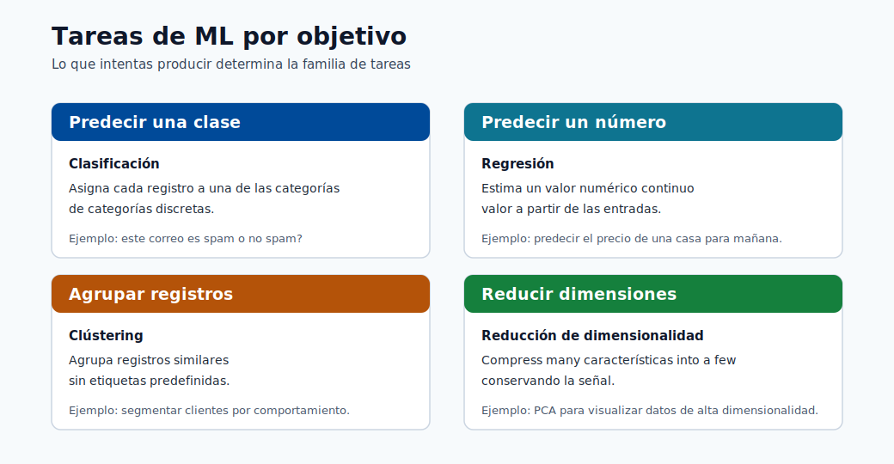
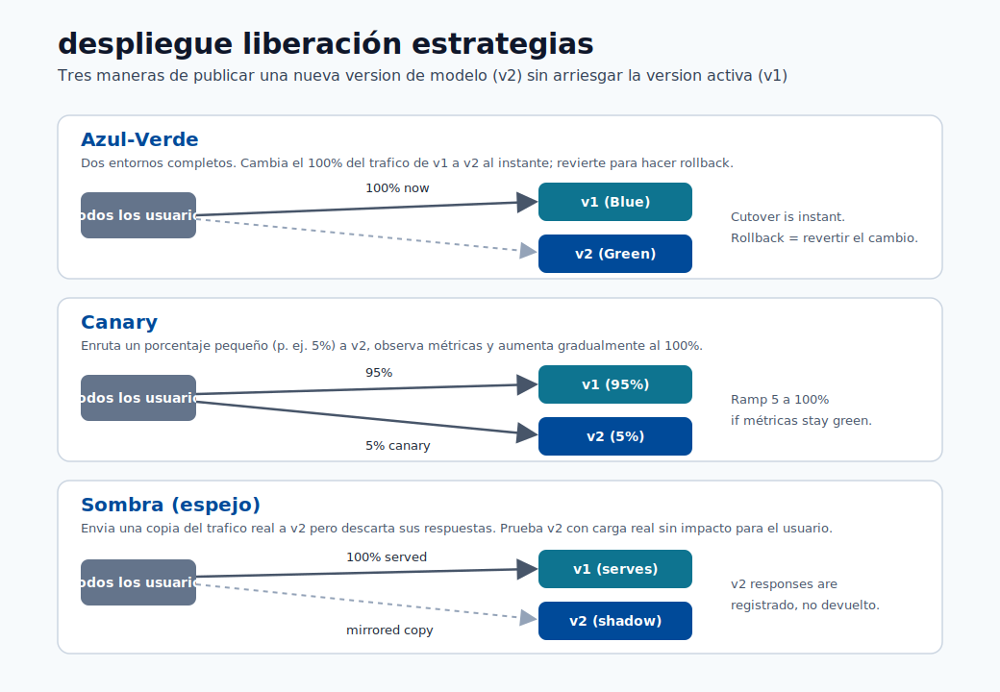
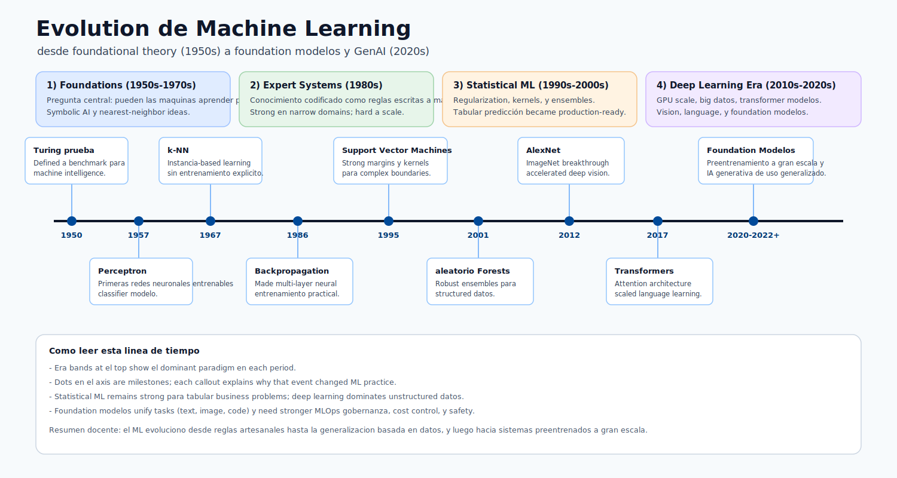

# 09. Cierre y Próximos Pasos

Este módulo resume lo aprendido en Machine Learning Fundamentals y define un plan práctico para continuar.

## Enlaces Rápidos

- Fundamentos de modelos: [Módulo 01](01-machine-learning-basics.md)
- Construcción y evaluación: [Módulo 05](05-build-your-first-model.md)
- Despliegue y puntuación: [Módulo 06](06-deploy-and-score.md)

## Lo Que Ya Comprendes

### Fundamentos ML

- ML aprende patrones en datos.
- Hay aprendizaje supervisado, no supervisado y por refuerzo.
- Todo proyecto usa características y variable objetivo.
- La calidad del dato define la calidad del modelo.

### Plataforma Azure ML

- Workspace como contenedor central.
- Assets: datos, environment, jobs, modelos, endpoints.
- Versionado y historial completo del proyecto.
- Entrenamiento y despliegue son etapas diferentes.

### Construcción de Modelo

- Limpiar, codificar y dividir datos antes de entrenar.
- Modelos iniciales: Linear Regression, Decisión Trees, Random Forest.
- Métricas: MAE, RMSE, R2, Accuracy, Precision, Recall.
- Overfitting y underfitting como señales de ajuste.

### Despliegue y Operación

- Endpoint recibe requests HTTP y devuelve predicciones.
- Online para tiempo real, batch para grandes volumenes.
- Monitoreo para detectar caidas de calidad y drift.
- Terraform para infraestructura repetible.

## Autoevaluación

1. Diferencia entre característica y variable objetivo con ejemplo.
2. Por qué usar división entrenamiento/prueba.
3. Cómo reconocer overfitting.
4. Que ocurre dentro de un endpoint.
5. Por que environment mejora reproducibilidad.
6. Cuando usar `terraform destroy`.

## Próximos Pasos

### Recursos

- [Azure ML Documentation](https://learn.microsoft.com/azure/machine-learning/)
- [Terraform Azure Provider](https://registry.terraform.io/providers/hashicorp/azurerm/latest)
- [Microsoft Fabric Documentation](https://learn.microsoft.com/fabric/)

## Perspectiva Final

ML busca decisiones utiles y confiables en produccion.
No gana el modelo más complejo; gana el que generaliza mejor y se mantiene estable en el tiempo.

