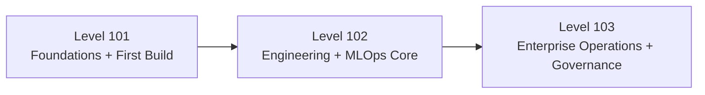

# AI Academy - Machine Learning 101

Welcome to **Level 101** of the Machine Learning academy.

This site uses the same GitHub Pages layout as the advanced Azure ML training site, reorganized for a beginner-first path under **Cloud2BR TEC**.

## Program Map

## What You Learn in 101

- Understand Azure Machine Learning core concepts and lifecycle.
- Navigate workspace, authoring tools, and key assets.
- Build and evaluate a first model using guided steps.
- Deploy a basic endpoint and test scoring.
- Understand Terraform basics for repeatable infrastructure.
- See how Fabric connects with AI workflows.

## Level 101 Modules

	<a class="home-card" href="modules/01-math-prerequisites/">
		01
		<h3>Program Levels</h3>
		
How 101, 102, and 103 are organized and what belongs in each level.

	</a>
	<a class="home-card" href="modules/02-e2e-overview/">
		02
		<h3>Azure ML Overview</h3>
		
Platform purpose, lifecycle, and role in the broader AI ecosystem.

	</a>
	<a class="home-card" href="modules/03-introduction/">
		03
		<h3>Workspace and Authoring</h3>
		
Workspace taxonomy and hands-on authoring options in Azure ML.

	</a>
	<a class="home-card" href="modules/04-ml-foundations/">
		04
		<h3>Assets and Lifecycle</h3>
		
Data, jobs, components, models, and endpoints in one workflow.

	</a>
	<a class="home-card" href="modules/05-neural-networks/">
		05
		<h3>Build Your First Model</h3>
		
Guided model creation flow based on your existing workshop.

	</a>
	<a class="home-card" href="modules/06-azure-ml-environment/">
		06
		<h3>Deploy and Score</h3>
		
Register models, deploy endpoints, and validate predictions.

	</a>
	<a class="home-card" href="modules/07-environment-setup/">
		07
		<h3>Terraform Foundations</h3>
		
Infrastructure as code baseline for Azure ML environments.

	</a>
	<a class="home-card" href="modules/08-data-preparation/">
		08
		<h3>Fabric and AI Integration</h3>
		
How Fabric, SynapseML, and Azure OpenAI fit into ML workflows.

	</a>
	<a class="home-card" href="modules/09-model-types/">
		09
		<h3>Path to 102 and 103</h3>
		
Next-level capabilities and transition criteria.

	</a>

