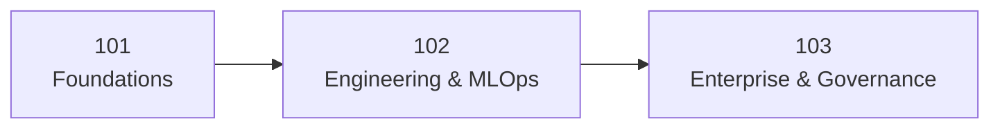

# 01. Program Levels

This academy is structured in three maturity levels so learners can progress from foundational understanding to production leadership.

## Level 101 (This Repository)

Focus:

- Azure ML concepts and terminology.
- Workspace basics and first end-to-end implementation.
- Introductory deployment and infrastructure as code.

Outcome:

- Build, evaluate, and deploy a first machine learning model with guided support.

## Level 102 (Planned)

Focus:

- Repeatable experimentation and pipeline modularization.
- Better validation and model comparison.
- Monitoring basics, retraining triggers, and CI/CD integration.

Outcome:

- Operate projects with reduced manual steps and stronger engineering quality.

## Level 103 (Planned)

Focus:

- Enterprise governance, security, and policy controls.
- Advanced deployment patterns, reliability, and rollback strategy.
- Responsible AI checks and platform-wide operations.

Outcome:

- Design and operate production-grade ML systems at organizational scale.

## Curriculum Logic

