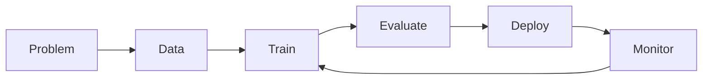

# 02. Azure ML Overview

Azure Machine Learning is the cloud workspace where you build, train, deploy, and monitor machine learning solutions.

## What Azure ML Provides

- One place for your data references, code, runs, and models.
- Repeatable workflows so results are not random.
- Visual and code-based ways to build solutions.

## End-to-End Lifecycle in Simple Words

1. Define the business question.
2. Prepare data.
3. Train model.
4. Check quality.
5. Deploy model.
6. Monitor and improve.

## Core Terms in Azure ML

- Workspace: your main project area.
- Compute: the machines that run your jobs.
- Job: one execution (training, scoring, processing).
- Model registry: saved versions of trained models.
- Endpoint: URL for prediction requests.

## Why Monitoring Exists

Real-world data changes over time.

- Model that worked in March may degrade in July.
- Monitoring catches drops in quality early.

## Visual Recap

