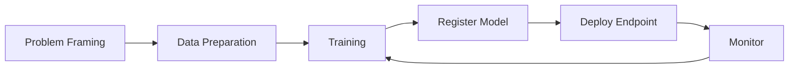

# 02. Azure ML Overview

Azure Machine Learning is a managed platform to build, train, deploy, and monitor machine learning models.

## Why It Matters

- Supports code-first and low-code workflows.
- Standardizes the full ML lifecycle.
- Integrates with core Azure services and popular frameworks.

## Core Lifecycle

1. Problem framing.
2. Data preparation.
3. Training and validation.
4. Model registration.
5. Deployment.
6. Monitoring and iteration.

## Azure ML in the Ecosystem

- Azure ML: full machine learning lifecycle and MLOps platform.
- Microsoft Fabric: strong analytics and data collaboration platform.
- Azure AI Foundry: AI app and model orchestration experience.

Level 101 uses this distinction so learners pick the right platform for the right task.
