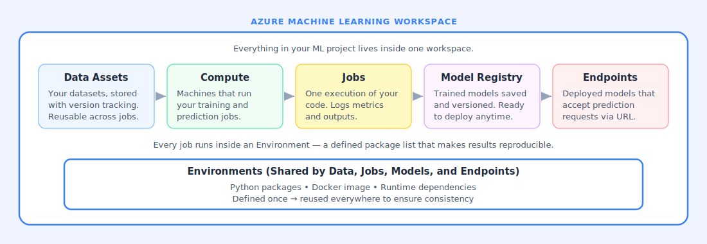
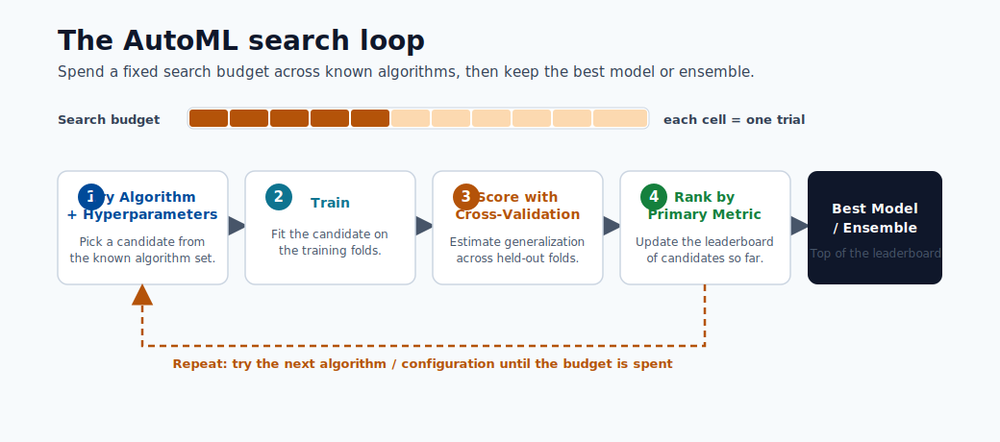
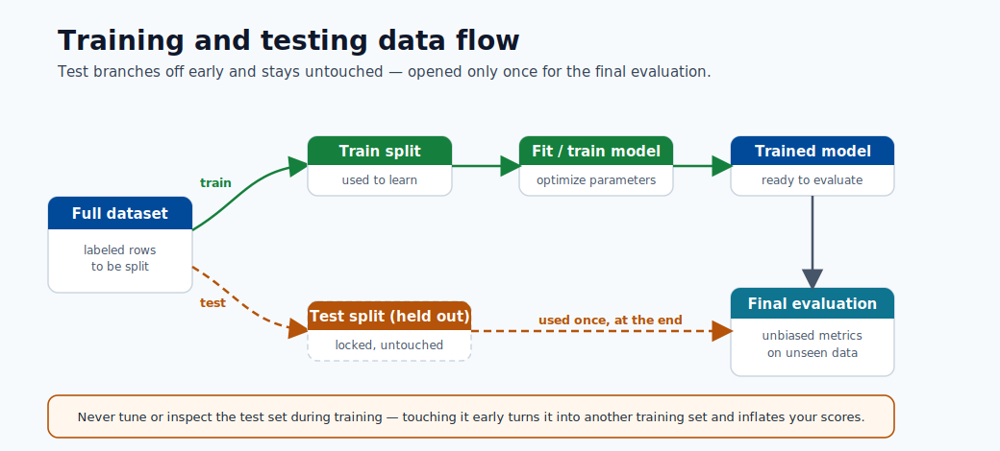

# 03. Workspace and Authoring

The Azure ML workspace is the central hub for everything in your project. All data references, compute resources, experiment runs, registered models, and endpoints are stored inside one workspace.

## Everything Inside the Workspace

### Data Assets

Data assets are versioned references to datasets stored in Azure Blob Storage or other data sources. Instead of copying files around, you register the dataset once and reference it by name and version in any job. This means every experiment knows exactly which data it used.

### Compute

Compute is the infrastructure that executes your code. Azure ML offers:

- **Compute Instances**: a single managed virtual machine for interactive development and notebook work.
- **Compute Clusters**: scalable multi-node pools that automatically grow or shrink based on workload.
- **Serverless compute**: on-demand resources with no manual cluster management.
- **Kubernetes clusters**: for production-grade, high-availability deployment.

### Jobs

A job is one execution of code. When you run a training script, it becomes a job. Azure ML logs the inputs, outputs, parameters, metrics, and code snapshot for every job automatically. You can compare any two jobs side by side to see which configuration produced better results.

### Environments

An environment is a versioned definition of the packages and dependencies your code needs to run. By pinning package versions in the environment, you ensure that the same code produces the same result whether it runs today or in six months.

### Model Registry

The model registry stores trained model artifacts with full metadata: which dataset and job produced them, what evaluation metrics they achieved, and which environment they were trained in. You can promote a model from development to production directly from the registry.

### Endpoints

An endpoint is a deployed model exposed as an HTTP API. Online endpoints return predictions in real time. Batch endpoints process large datasets asynchronously.

## Authoring Options

### Notebooks

Notebooks run directly inside the workspace on a compute instance. You write Python code in cells and execute them one at a time. Every output is visible immediately. Notebooks are the best place to explore data, prototype ideas, and build the first version of a training script.

### AutoML

Automated ML tests dozens of algorithms and hyperparameter combinations automatically. You provide a dataset and a target column. Azure ML trains and evaluates many models in parallel and returns the best one. AutoML is useful when you want a strong baseline quickly or when you want to compare automated results against your manual approach.

### Designer

Designer is a drag-and-drop visual interface for building ML pipelines. Each step is a module (data split, normalization, training, evaluation). You connect modules with lines to define the data flow. Designer is good for understanding what a pipeline does visually before converting it to code.

## Key Vocabulary

| Term | Meaning |
|------|----------|
| **Experiment** | A named group of related runs for comparison. |
| **Run** | One execution of a job with specific inputs and settings. |
| **Pipeline** | A sequence of steps connected by data flow, run as one unit. |
| **Artifact** | Any output saved by a job: model file, metrics CSV, logs. |
| **Lineage** | The complete record of what data, code, and environment produced a model. |

## How It All Connects

Workspace is the project container. Compute is the execution engine. Jobs are the runs executed with that engine. Environments guarantee each run is reproducible. The model registry captures what was built. Endpoints make it available.
