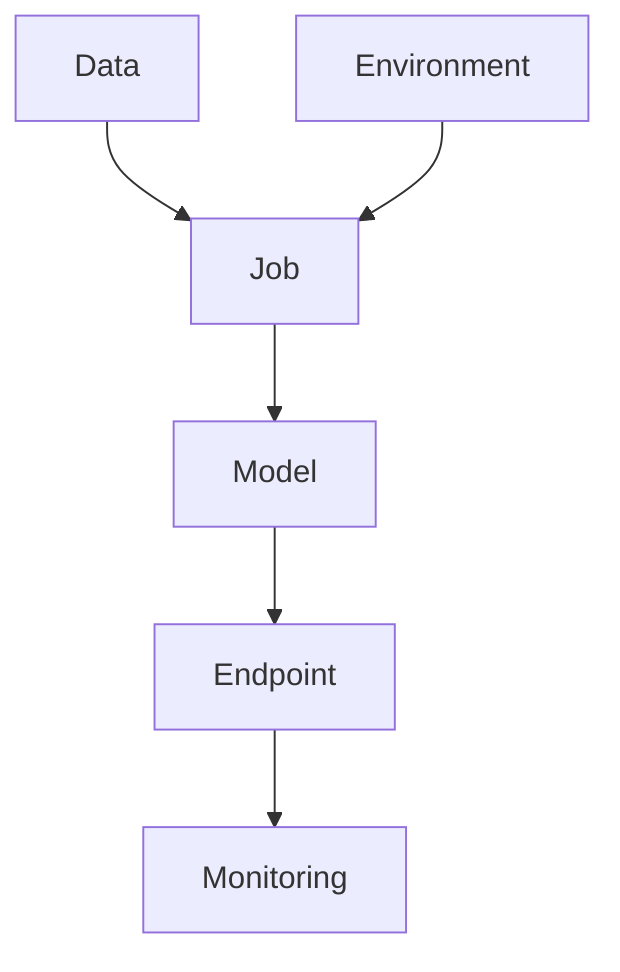

# 04. Assets and Lifecycle

In Azure ML, "assets" are the important pieces you save and reuse.

## Core Assets Explained Simply

- Data asset: where your input data lives.
- Environment: package list and runtime setup.
- Job: a run that executes code.
- Model: trained result.
- Endpoint: deployed API for predictions.

## Why Asset Tracking Matters

Without tracking, you cannot answer:

- Which dataset trained this model?
- Which code version produced this result?
- Which dependency version was used?

## Lifecycle View

## Practical Analogy

Imagine baking:

- Data = ingredients.
- Environment = kitchen setup.
- Job = cooking session.
- Model = final cake.
- Endpoint = serving counter where people request slices.

## Visual Summary

