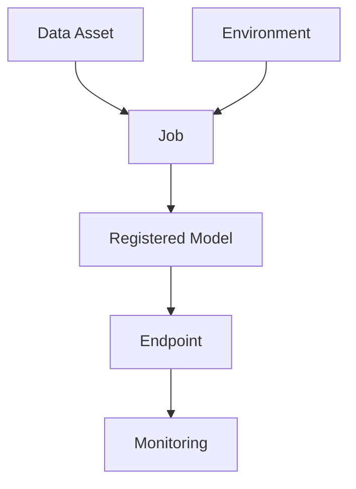

# 04. Assets and Lifecycle

In Azure ML, production readiness depends on using assets consistently across the lifecycle.

## Core Assets

- Data: versioned input for reproducible runs.
- Jobs: executable units with logs and metrics.
- Components: reusable units for pipelines.
- Environments: dependency-controlled runtime definitions.
- Models: registered trained artifacts.
- Endpoints: online or batch serving interfaces.

## Asset Flow

## 101 Practice

For Level 101, the goal is not advanced optimization. The goal is clean lineage: know what data, code, and environment produced each model and deployment.
