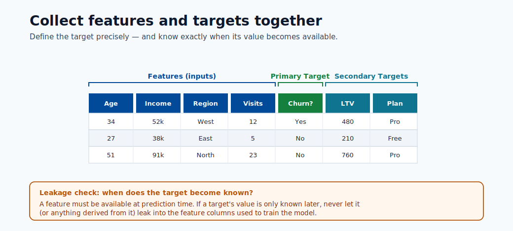
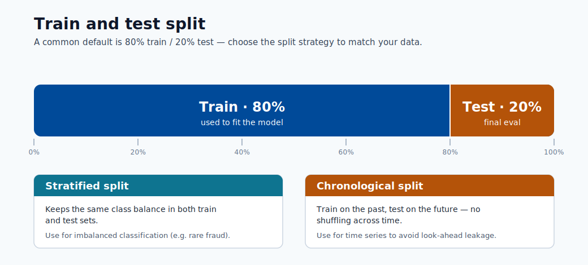
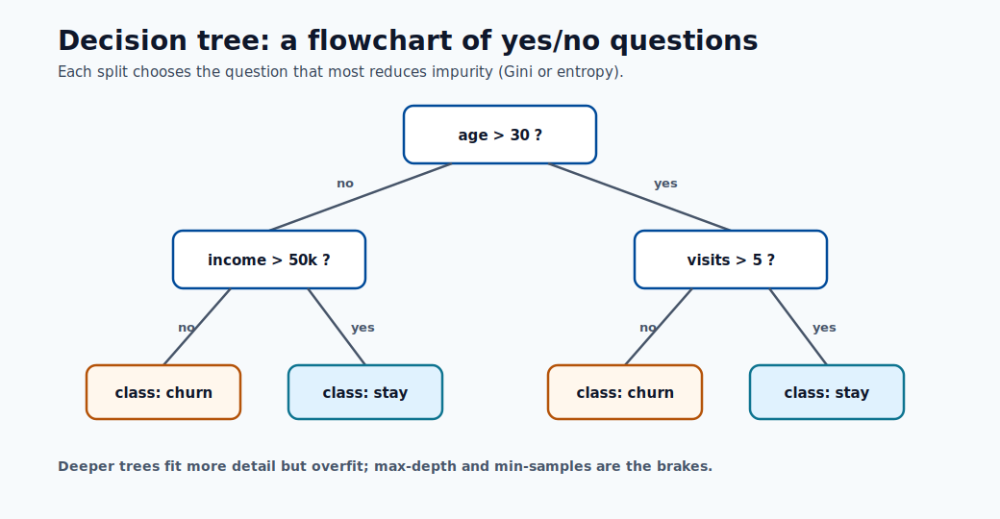
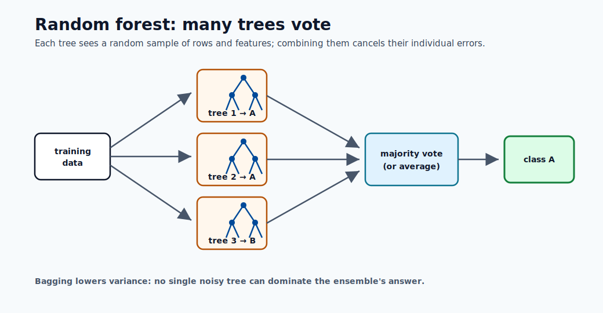
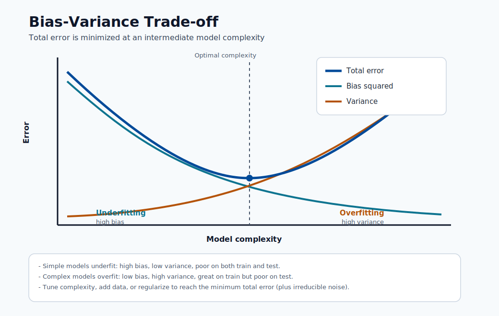
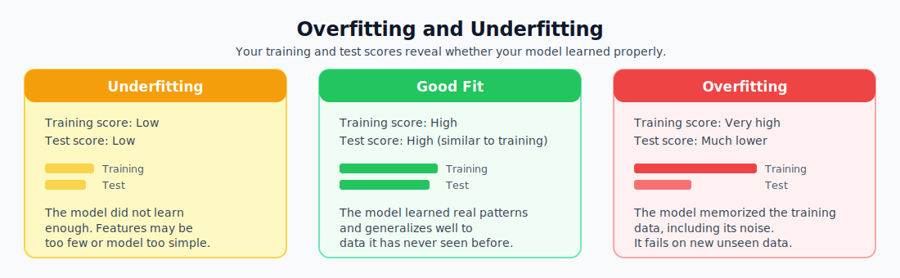

# 05. Build Your First Model

This module walks through every step of building a real machine learning model from raw data to a saved, evaluated artifact.

## Step 1: Define the Problem Clearly

Before writing any code, answer these questions:

- What do you want to predict?
- What data do you have available?
- What counts as a good result?

Example: predict whether a customer will cancel their subscription in the next 30 days.

- **Target**: churn (yes or no).
- **Features**: contract length, monthly charge, support tickets filed, last login date.
- **Success metric**: at least 80% accuracy on test data.

## Step 2: Collect and Understand Your Data

Load your data and check the basics:

- How many rows and columns?
- Are there missing values?
- What is the distribution of the target?
- Do any features look suspicious (e.g., all zeros, future dates)?




## Step 3: Prepare Features

Raw data is rarely ready to feed into a model. Common preparation steps:

- **Handle missing values**: fill with mean, median, mode, or remove rows.
- **Encode categories**: convert text categories to numbers (e.g., "region" → 0, 1, 2).
- **Scale numbers**: normalize or standardize numeric features so no single feature dominates.
- **Remove irrelevant columns**: drop IDs, timestamps, or columns with no predictive value.

## Step 4: Split Data into Training and Test Sets

Never evaluate a model on the same data used to train it. The test set simulates what the model will face in production.

- **Typical split**: 80% training, 20% testing.
- The test set must stay hidden until final evaluation.



## Step 5: Choose and Train a Model

Good starting models:

- **Linear Regression** — numeric target (e.g., predict price).
- **Logistic Regression** — binary classification (yes/no).
- **Decision Tree** — easy to inspect and explain.
- **Random Forest** — strong baseline for most tabular datasets.





## Step 6: Evaluate the Model

### Regression Metrics (when target is a number)

- **MAE** — Mean Absolute Error. Average size of the prediction error in the original unit.
- **RMSE** — Root Mean Squared Error. Like MAE but punishes large errors more.
- **R²** — Proportion of variance in the target that the model explains. Range 0 to 1; higher is better.

### Classification Metrics (when target is a category)

- **Accuracy** — Percentage of correct predictions overall.
- **Precision** — Of all predicted positives, how many were actually positive?
- **Recall** — Of all actual positives, how many did the model catch?
- **F1 Score** — Harmonic mean of precision and recall. Useful when the dataset is imbalanced.




## Step 7: Interpret the Results



- **Overfitting**: training score is very high, test score is much lower. The model memorized training data and does not generalize. Fix: simplify the model, add regularization, get more data.
- **Underfitting**: both scores are low. The model did not learn the patterns. Fix: add more features, try a more complex model, train for more iterations.
- **Good fit**: training and test scores are both high and close to each other.


## Step 8: Register the Model

Once satisfied with results, register the model in Azure ML:

```python
ml_client.models.create_or_update(
    Model(path="./model.pkl", name="churn-predictor", version="1")
)
```

Registration saves the model file, links it to the training job, and makes it available for deployment.

## Checklist Before Deployment

- [ ] Data is cleaned and splits are verified.
- [ ] Evaluation metrics meet the defined success criteria.
- [ ] Results are explainable (you can say why the model makes certain predictions).
- [ ] Model is registered with the correct metadata.
- [ ] Notebook or script is reproducible by someone else.
