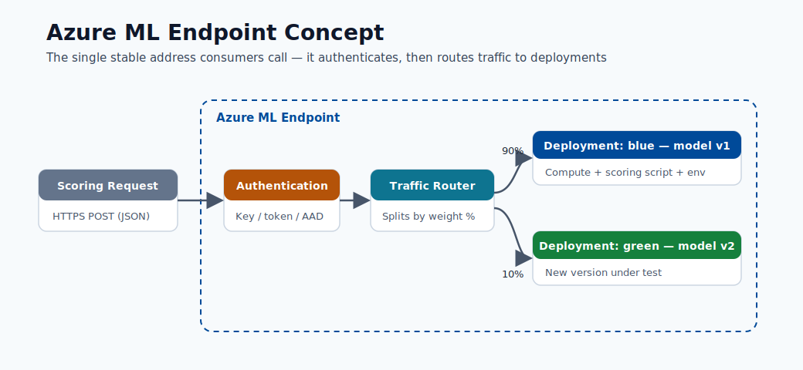
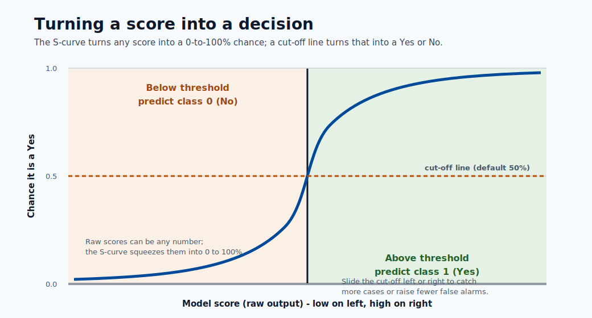

# 06. Deploy and Score

Deployment means your trained model becomes available for real requests.

## Deployment Perspective

- Training happens offline.
- Deployment makes an online prediction service.

## What Is an Endpoint?

An endpoint is a URL that receives data and returns a prediction.

Input example:

- customer age, balance, region

Output example:

- churn risk score = 0.72

## Basic Deploy Steps

1. Register the model.
2. Add scoring script (`score.py`).
3. Define environment dependencies.
4. Deploy endpoint.
5. Test with sample payload.

## Quality Checks

- Response time is acceptable.
- Output format is stable.
- Error messages are understandable.
- Logs are available for debugging.

## Cost Safety

Stop unused compute and endpoints when not needed.
