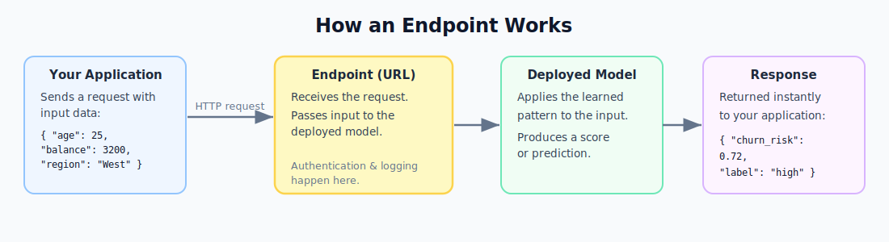

# 06. Deploy and Score

Deployment is the step where your trained model leaves the development environment and becomes a live service that other applications can call to receive predictions.


## Training vs Deployment

These are two distinct phases:

- **Training** happens offline. It is computationally intensive, runs on large datasets, and produces a model file.
- **Deployment** happens online. The model file is loaded into a running service that waits for input and returns predictions in milliseconds.

The model does not retrain during deployment. It applies the fixed pattern it learned during training to each new request.

## What Is an Endpoint?

An endpoint is a URL that your application sends data to and receives a prediction from. It is a standard HTTP API.



### Online Endpoint

Returns a prediction for each individual request in real time. Used for interactive applications where the user or system needs an immediate answer.

Example: a bank checks each transaction the moment it occurs and needs a fraud score within 100ms.

### Batch Endpoint

Processes a large file or dataset all at once. The job runs in the background and produces an output file when complete.

Example: score 500,000 customer records overnight to generate marketing segments for the next day.


## How to Deploy: The Five Steps

1. **Register the model** in the Azure ML model registry.
2. **Write a scoring script** (`score.py`) with two functions:
   - `init()`: loads the model into memory when the service starts.
   - `run(data)`: accepts input, calls the model, and returns the prediction.
3. **Define an environment** that lists all packages the scoring script needs.
4. **Deploy** the model, script, and environment to an endpoint with a compute configuration.
5. **Test** by sending a sample request and verifying the response.


## Understanding the Request and Response


A typical request:
```json
{ "age": 34, "balance": 4200, "contract": "monthly" }
```

A typical response:
```json
{ "prediction": "churn", "probability": 0.81 }
```

## Quality Checks Before Going Live

- Response latency is within acceptable limits.
- Output format is consistent and documented.
- The endpoint handles unexpected inputs gracefully.
- Logs are available and error messages are informative.
- Authentication is enabled so only authorized callers can access it.


## Cost Management

Running compute costs money. Rules to follow:

- Scale down or delete endpoints that are not actively serving traffic.
- Use the minimum compute size that meets latency requirements.
- For development testing, use the smallest available instance type.
