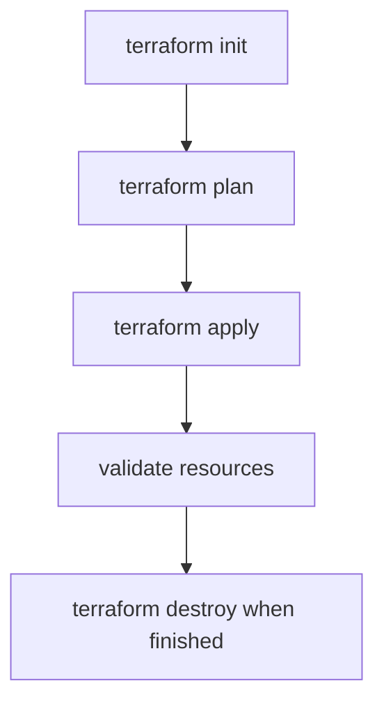

# 07. Terraform Foundations

This module introduces infrastructure as code using your existing Terraform examples.

## Why IaC in Level 101

- Repeatable environment creation.
- Version-controlled infrastructure changes.
- Shared setup across teams and workshops.

## Included Scope

- Azure ML platform baseline resources.
- Provider and variable structure.
- Remote state storage concept.
- `init`, `plan`, `apply`, and `destroy` flow.

## Cost and Safety Note

Always destroy or pause unused resources after practice sessions.
