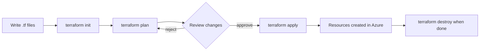
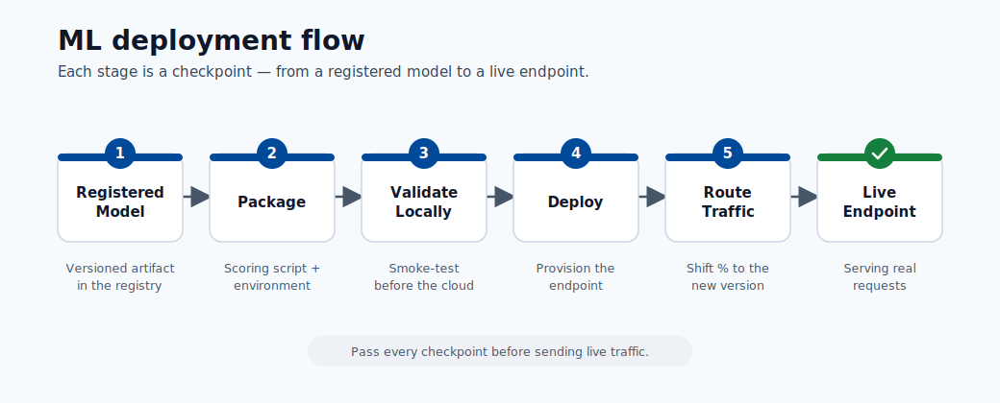

# 07. Terraform Foundations

Terraform is a tool for creating and managing cloud infrastructure using code files instead of clicking through a web portal. This practice is called **Infrastructure as Code (IaC)**.


## The Problem Terraform Solves

Without IaC, setting up an Azure ML workspace involves navigating many portal pages, configuring dozens of settings by hand, and repeating the process for every new environment (development, staging, production). The result is:

- Environments that are slightly different from each other.
- No record of what was configured or when.
- No easy way to recreate the setup if something breaks.

With Terraform:

- The desired state is written in `.tf` files.
- Terraform compares the desired state to what exists and makes only the necessary changes.
- The files are stored in version control, giving a complete history.

## How Terraform Works





## The Four Core Commands

### `terraform init`

Downloads the provider plugins required by your configuration. Run this once when you start a new project or when you add a new provider.

### `terraform plan`

Shows exactly what Terraform will create, change, or destroy if you run `apply`. No resources are touched during `plan`. Review this output carefully before proceeding.

### `terraform apply`

Executes the changes shown in the plan. Terraform creates or modifies resources in Azure. It prompts for confirmation before making changes unless you pass the `-auto-approve` flag.

### `terraform destroy`

Removes all resources managed by the configuration. Always run `destroy` after completing a workshop or practice session to avoid ongoing costs.

## Core Vocabulary

| Term | Meaning |
|------|----------|
| **Provider** | A plugin that allows Terraform to communicate with a cloud platform (e.g., Azure). |
| **Resource** | A single piece of infrastructure (e.g., a storage account, an ML workspace). |
| **State** | A file that records which real resources Terraform is managing. |
| **Variable** | A named input value that can be reused across the configuration. |
| **Output** | A value that Terraform displays after apply (e.g., an endpoint URL). |
| **Module** | A reusable block of Terraform configuration, like a function. |
| **Backend** | Where the state file is stored (locally or in Azure Blob Storage for teams). |

## File Structure for an Azure ML Deployment

```
src/
├── main.tf          # resources to create
├── variables.tf     # variable definitions
├── terraform.tfvars # actual values for variables
├── provider.tf      # Azure provider configuration
├── outputs.tf       # values to display after apply
└── remote-storage.tf # backend configuration for shared state
```

## Why Remote State Matters for Teams

By default, the state file is stored locally. If two people run Terraform simultaneously, the state file can become inconsistent. Storing state in Azure Blob Storage with locking enabled prevents this. Only one operation can modify the state at a time.

## Cost Safety

Cloud resources accrue charges the moment they exist. After every practice session:

1. Confirm your Azure ML workspace is the target.
2. Run `terraform destroy -var-file terraform.tfvars`.
3. Verify in the Azure portal that resources are removed.
