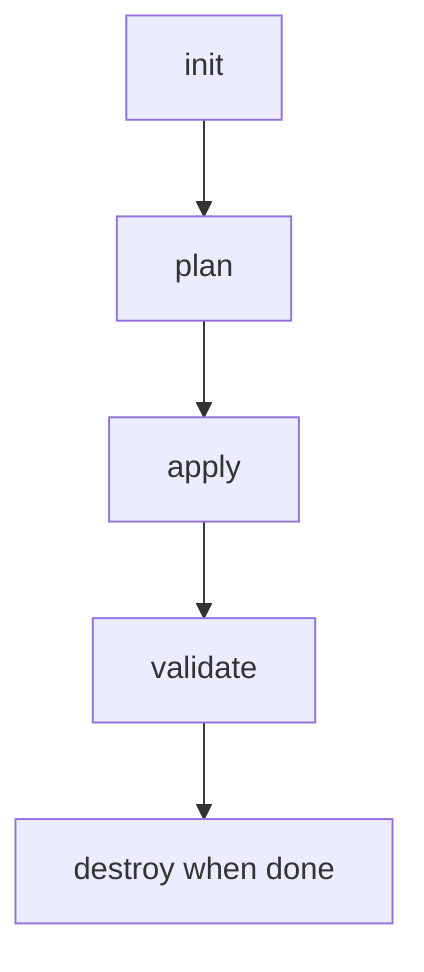

# 07. Terraform Foundations

Terraform is a tool to create cloud resources from code files.

## Definition

Instead of clicking many buttons in the portal:

- You write desired resources in files.
- Terraform creates them consistently.

## Why This Matters

- Repeatable setup.
- Easier teamwork.
- Fewer manual mistakes.

## Four Commands You Need First

- `terraform init`: prepare project.
- `terraform plan`: preview changes.
- `terraform apply`: create/update resources.
- `terraform destroy`: clean up resources.

## Core Vocabulary

- Provider: plugin to talk to Azure.
- State: record of managed resources.
- Variable: reusable input value.
- Output: values shown after deployment.

## Practical Warning

Cloud resources cost money. Use `destroy` after practice labs.
