# Visual Library

This page includes all image assets available for Course 101.

## activation-functions.svg

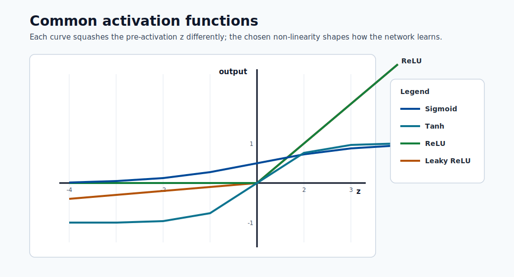

## automl_diagram.svg

## automl_process_what_to_expect.svg

## azure-endpoint-concept.svg

## azure-machine-learning-taxonomy.svg

## azure-ml-environment-taxonomy.svg

## bayes-theorem.svg

## bias-variance-tradeoff.svg

## binary_vs_decimal_data_measurements.svg

## collect_data_init_primary_second_targets.svg

## confusion_matrix_good_bad.svg

## decision-tree.svg

## deployment_overview.svg

## Detailed-steps-of-ML-based-time-series-forecast.svg

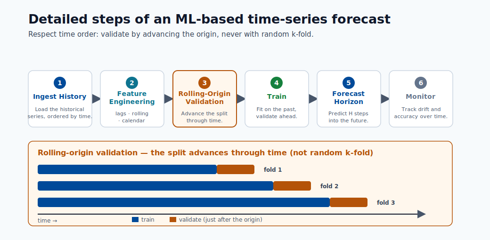

## endpoint-request-response.svg

## feature_engineering_collect_data.svg

## gaussian-distribution.svg

## gradient-boosting.svg

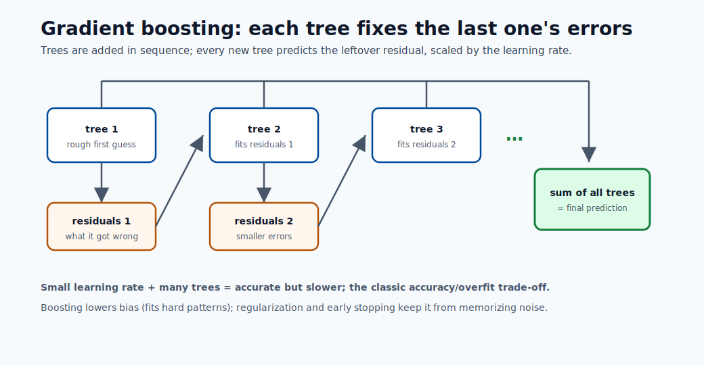

## gradient-descent-loss.svg

## How-to-Choose-a-Metric-for-Imbalanced-Classification-latest.svg

## lift_good_bad.svg

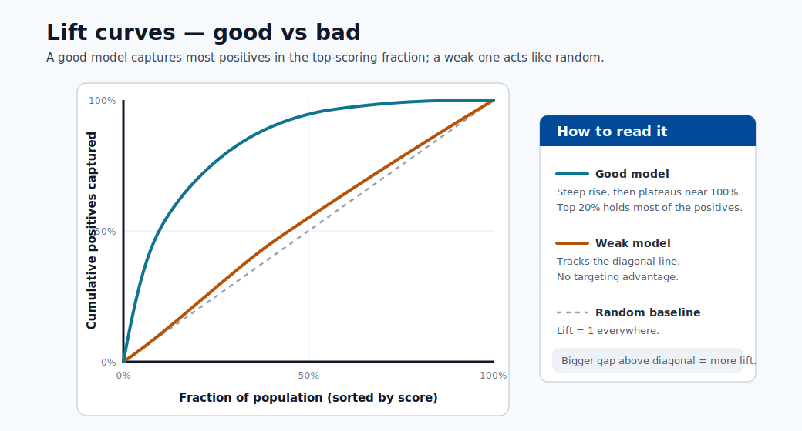

## linear-regression-fit.svg

## logic_schema_model_implementation.svg

## logistic-regression-boundary.svg

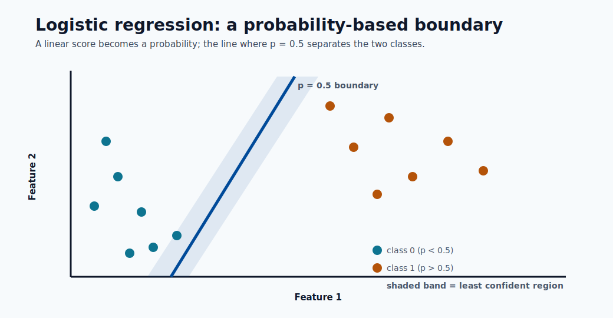

## machine_learning_types.svg

## ml_deployment_flow.svg

## ml_process_by_stages.svg

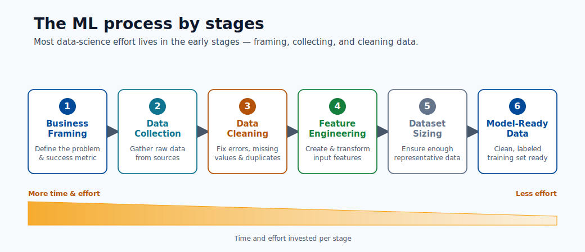

## ml_workflow_stages.svg

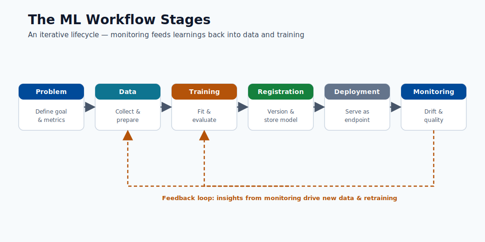

## ml-e2e-workflow.svg

## ml-evolution-timeline.svg

## ml-infrastructure-tools-for-production.svg

## ml-math-pipeline.svg

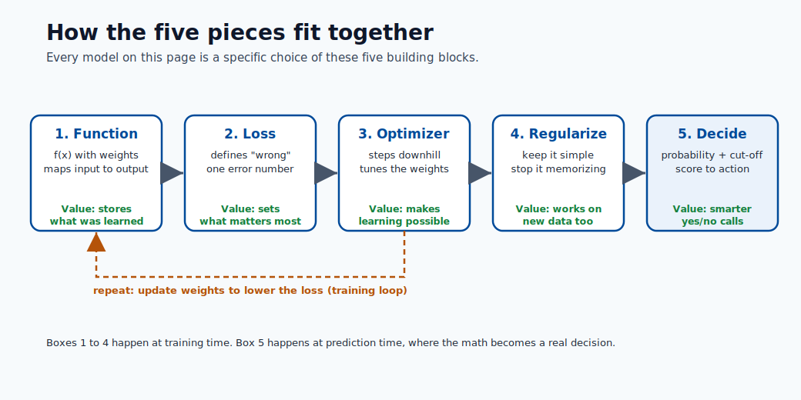

## msft-dataset-size-guidance.svg

## naive-bayes.svg

## neural-network.svg

## neuron-anatomy.svg

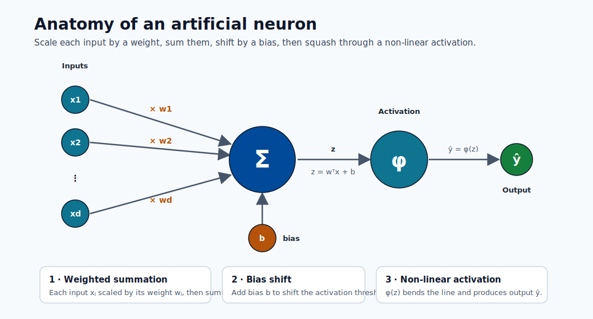

## org-logo.png

## Overview_ML_flow.svg

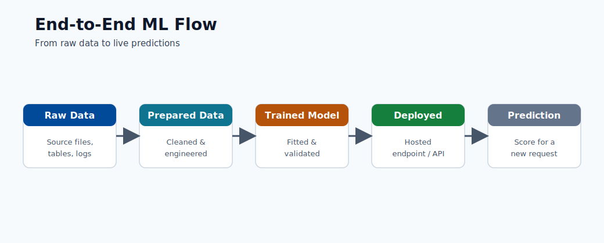

## precisionrecall_good_bad.svg

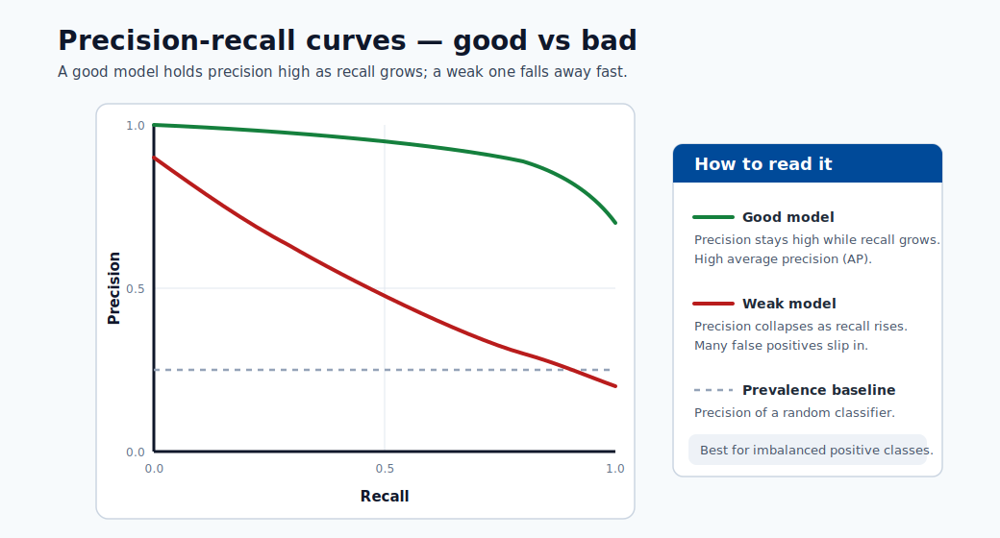

## probability-distributions.svg

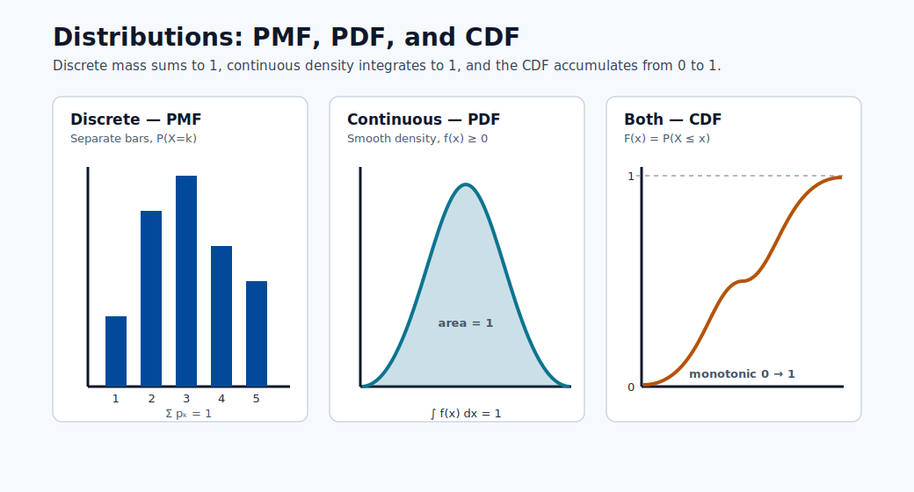

## python_dtype.svg

## random-forest.svg

## release-strategies.svg

## roc_good_bad.svg

## score-to-decision.svg

## summary_of_number_system.svg

## svm-margin.svg

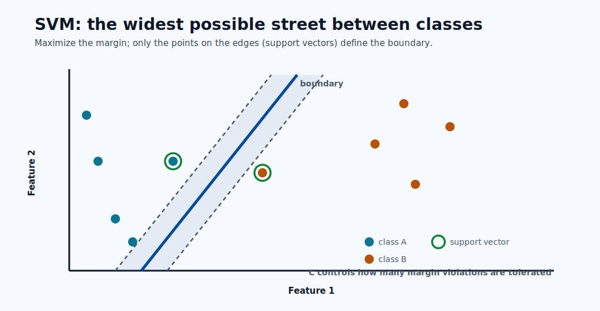

## table_webservice_vs_api.svg

## time-series-forecast.svg

## training_test_split.svg

## training_testing_data_flow.svg

## training_vs_deployment_model.svg

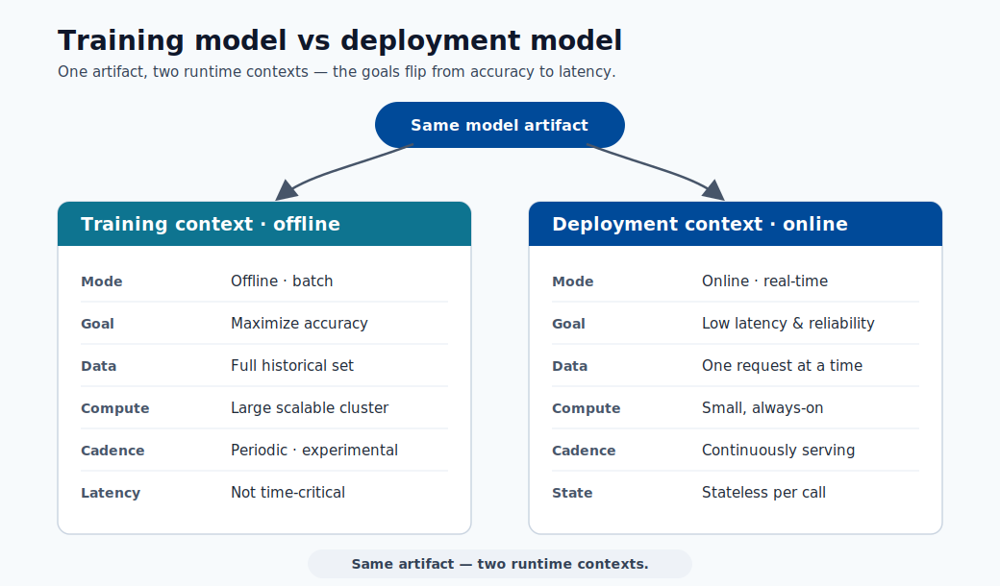

## types_of_ml_based_in_objective.svg

## webservice_vs_api.svg

## xor-not-separable.svg

